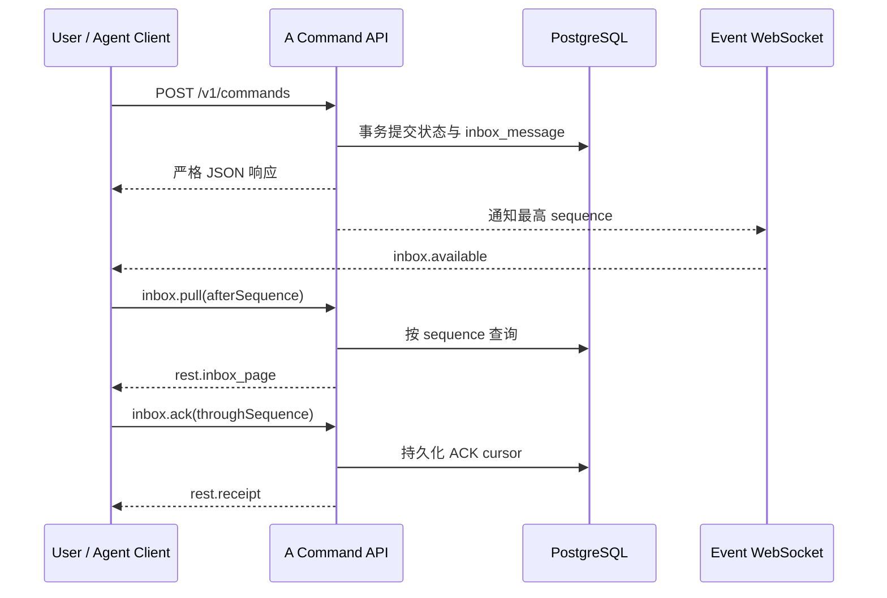

# SciForge A 云端协作最小公共 API

_面向 A 自身 MVP 与后续适配器联调；协议版本 `1.0`，示例地址不代表任何已部署公网服务。_

---

## 📋 文档范围与状态

本文只描述 A 云端协作核心对外交换的数据，不描述 B、C、D、E 各自模块的内部实现。示例统一使用：

```text
https://collaboration.example.invalid
```

这是保留域名示例，不表示域名、TLS、provider adapter 或 ECS 公网入口已经部署。本文中的能力状态含义如下：

| 标记 | 含义 |
|---|---|
| 当前可用 | 已存在严格合同与 HTTP 分发，可在部署后按本文调用 |
| 本地已验收 | 严格合同、HTTP 分发、持久化实现与自动测试均已通过；是否已部署由运维状态另行说明 |
| 依赖 provider | A 已定义边界，但必须由经过验证的 provider gateway 调用；本文不承诺 provider 已部署 |
| 暂无公开能力 | A 没有对应公共 command；调用方不得依赖数据库、内部 service 方法或私有结构替代 |

A 核心只保存协作所需身份、项目、任务、持久 Inbox、人工确认、共享记录和资源引用。A 不运行 Agent，不读取本地文件，不保存完整私人对话、工具日志、资源正文、长期凭据、本地绝对路径，也不替项目负责人作最终决定。

## 🌐 公共业务入口

本协议冻结 A 的 HTTP/WSS 公共边界，不冻结正式域名、base path 或 Human Provider。是否采用 Zulip、Zulip 与 A 的具体适配方式，以及正式产品的双向消息路径均待团队确认。无论最终选择何种入口，本地 SciForge 与 A 之间都只交换本合同定义的 Task、Inbox、状态、引用和结果；SSH tunnel 只是服务器预发布诊断手段，不是正式产品入口。

Project/Task/Inbox 等领域查询和写操作通过同一个严格 command 信封发送；统一身份使用下列独立 REST 路由，仍共享 Bearer、幂等、错误与审计边界：

| 用途 | 方法与地址 | 说明 |
|---|---|---|
| 业务命令与查询 | `POST https://collaboration.example.invalid/v1/commands` | 由 JSON 的 `type` 区分 command；不存在 `/v1/projects`、`/v1/tasks` 等独立 REST 路由 |
| 统一身份 | `GET/POST/DELETE https://collaboration.example.invalid/v1/...` | `/v1/me`、Device enrollment/create/list/revoke、Zulip binding 与外部身份接口；详见“Actor 由凭据解析” |
| 实时唤醒 | `GET wss://collaboration.example.invalid/v1/events` | WebSocket Upgrade；只通知 Inbox 有新消息，不传递完整领域事实 |
| A 网页控制台 | `GET https://collaboration.example.invalid/console/` | 同源薄控制面；凭据仅存页面内存，不提供 B–E 私有业务逻辑 |
| 存活检查 | `GET https://collaboration.example.invalid/healthz` | 仅表示进程可响应 |
| 数据库就绪检查 | `GET https://collaboration.example.invalid/readyz` | 只表示数据库 schema 与关键约束就绪；不证明 OIDC/JWKS、confirm adapter 或 Provider 已配置 |

## 📦 机器可读合同

文字示例用于解释语义，严格字段以仓库内协议 `1.0` 生成物为准：

```text
packages/collaboration-contracts/artifacts/protocol-1.0/
├── ARTIFACT_MANIFEST.json
├── schemas/
│   ├── commands.schema.json
│   ├── responses.schema.json
│   ├── inbox.schema.json
│   ├── entities.schema.json
│   ├── errors.schema.json
│   ├── identity-me-response.schema.json
│   ├── identity-device-enrollment-create-request.schema.json
│   ├── identity-device-enrollment-create-response.schema.json
│   ├── identity-device-create-request.schema.json
│   ├── identity-device-response.schema.json
│   ├── identity-device-list-response.schema.json
│   ├── identity-device-revoke-request.schema.json
│   ├── identity-zulip-binding-begin-request.schema.json
│   ├── identity-zulip-binding-begin-response.schema.json
│   ├── identity-zulip-binding-confirm-request.schema.json
│   ├── identity-zulip-binding-confirm-response.schema.json
│   ├── identity-external-identity-list-response.schema.json
│   ├── identity-external-identity-revoke-request.schema.json
│   └── identity-external-identity-response.schema.json
├── state-and-actors.json
└── fixtures/
    └── device-enrollment-signing-v1.json
```

`ARTIFACT_MANIFEST.json` 记录协议版本、合同 commit 注入位、文件 SHA-256 与验收状态。源码工作树中使用 `__SCIFORGE_COLLABORATION_COMMIT__`，固定发布必须用 `--commit <完整40位SHA>` 重新生成，不能把占位值当成已发布版本。状态/actor 表覆盖严格 command union；fixtures 覆盖正常、重复、乱序、revision conflict、idempotency conflict、旧 execution、失效确认和当前 Agent bearer 撤销。

统一身份 REST 不使用 command envelope，因此另行发布上述严格 body schema，完整覆盖 `/v1/me`、Device enrollment/create/list/revoke、Zulip binding begin/confirm 和 external identity list/revoke；每份都以 `x-sciforge-http.bindings` 机器字段标明 HTTP method、path 和 request/response 方向。`identity-device-response.schema.json` 同时用于 Device create 与 revoke 的成功响应，公共错误仍统一由 `errors.schema.json` 表示。

Device PoP 的公共 canonicalization 入口是 `@sciforge/collaboration-contracts` 导出的纯函数 `canonicalEnrollmentBytes`，返回跨运行时的 `Uint8Array`。它按下列固定顺序产生 **6 行 UTF-8**，各行之间只有一个 LF 字节（`0x0A`），`expiresAt` 后 **没有末尾 LF**：

```text
SCIFORGE-DEVICE-ENROLLMENT-V1
<enrollmentId>
<nonce>
<userId>
<installationId>
<expiresAt>
```

上述代码块最后一行之后的展示换行不属于签名数据。五个输入字段必须是非空且不含 CR/LF 的字符串；函数不修剪或重排字段。`fixtures/device-enrollment-signing-v1.json` 固定了同一输入的 canonical UTF-8 文本、base64url、hex、字节数、预期 Ed25519 公开 JWK 与签名。该向量只含公开测试材料，不含私钥或生产 secret，客户端可直接用它做跨语言互操作测试。

```bash
npm run collaboration:contracts:generate
npm run collaboration:contracts:check
npm run collaboration:contracts:test
```

生成物来自正式 Zod exports，不允许手工维护第二套 JSON Schema。`--check` 会在 schema、权限表或 fixture 漂移时失败。

所有请求至少包含：

```json
{
  "protocolVersion": "1.0",
  "requestId": "req_demo0000000001",
  "type": "project.get",
  "projectId": "prj_demo0000000001"
}
```

`requestId` 用于关联一次请求与响应，不负责幂等。ID 是不透明字符串，客户端不得解析其中含义。

## 🔐 认证、actor 与并发控制

### Actor 由凭据解析

普通认证请求使用：

```http
Content-Type: application/json
Authorization: Bearer <credential>
```

服务器从认证凭据解析 actor。请求体中的 `ownerUserId`、`senderUserId`、`assigneeAgentId` 等字段只是目标或关联字段，不能自报 actor，也不能扩大权限。

| 公共 actor | 凭据来源 | 可用边界 |
|---|---|---|
| anonymous | 无凭据 | 仅限受限的 `endpoint.catalog.get`；不能发起或查询 Zulip binding，不能创建 User、Device 或 Agent |
| user | 配置 issuer 签发且通过严格 RS256/claims 验证的 OIDC Access Token | `/v1/me`、Device、Zulip binding、本人资料、Project owner 操作，以及 active Project member 的读取/提交 |
| agent | `agent.register` 成功后一次性返回的 opaque Agent bearer | Agent 心跳、Coordinator 操作、当前 assignee 的 Task 操作和 Agent Inbox；认证时同时检查 User、Device、Agent 与 credential 均为 ACTIVE |
| service | 独立 adapter 验证后注入的 service actor | 仅 `/v1/integrations/zulip/bindings/confirm`；不能形成 User actor 或调用普通 User API |
| human_endpoint | provider gateway 验证且已绑定到 User 的身份 | `project.input.create`、`human.answer` 等 provider 边界；不是普通 Bearer 客户端可伪造的 actor |

`system` 是服务内部 actor，不属于公共调用方。凭据不得放在 URL、请求 JSON、日志或 ResourceRef 中。

每个部署只配置一个精确 OIDC issuer。A 从该 issuer 的 Discovery/JWKS 按 `kid` 验证 RSA/RS256 签名，要求 `aud` 包含 `sciforge-cloud-api`、`azp` 为 `sciforge-desktop` 或 `sciforge-web-mobile`，并严格检查 `sub/exp/nbf/iat/auth_time`。首次成功认证以 `(issuer, sub)` 并发安全地 JIT 创建 User；相同 email 不合并。JWT 验证失败不会回退到旧 opaque User bearer。

统一身份 REST 面如下；所有 User 路由都要求同一个 OIDC resolver，所有写请求的 `Idempotency-Key` 头必须与 body 完全一致：

| 方法与路径 | Actor | 语义 |
|---|---|---|
| `GET /v1/me` | OIDC User | 返回稳定 `userId` 与本地 ACTIVE 状态 |
| `POST /v1/device-enrollments` | OIDC User | 为 `installationId` 返回五分钟、一次性的 enrollment nonce |
| `POST /v1/devices` | OIDC User | 验证规范 enrollment bytes 的 Ed25519 签名，创建含 `platform`、公开 JWK 与 `capabilitySummary` 的 Device |
| `GET /v1/me/devices` | OIDC User | 仅列出当前 User 的 Device |
| `DELETE /v1/me/devices/{deviceId}` | OIDC User，且 `auth_time` 在五分钟内 | 写 REVOKED，并立即撤销该 Device 下 Agent credential |
| `POST /v1/integrations/zulip/bindings` | OIDC User | 生成与当前 `userId` 绑定的五分钟一次性 code，供 D 的 `/bind CODE` 流程使用 |
| `POST /v1/integrations/zulip/bindings/confirm` | 受信 service actor | adapter 验证 D 传来的 Realm/User/event 上下文后消费 code；不接收目标 `userId`，不创建 User |
| `GET /v1/me/external-identities` | OIDC User | 列出当前 User 的非敏感 Zulip identity |
| `DELETE /v1/me/external-identities/{externalIdentityId}` | OIDC User，且 `auth_time` 在五分钟内 | 写 REVOKED，并作废同 User/Realm 的待用 code |

`platform`、Ed25519 `publicKeyJwk` 和 `capabilitySummary` 是 Device 属性。随后 `agent.register` 必须引用当前 User 自己的 ACTIVE `deviceId`，只创建或确认 Agent→Device 关联，不创建 Device、不消费 enrollment；Agent 继续单独保存节点 `capabilities`。Device 撤销不会删除历史，但会使该 Device 下的 Agent 认证立即失效。

OIDC issuer 未配置时，服务仍可启动，数据库正常时 `/readyz` 仍可返回 200，但全部 User API fail closed；这不是匿名模式。Zulip confirm 没有已注入的 service-auth adapter 时同样 fail closed。`pairing.begin/redeem` 只保留为上述单一 Zulip binding 状态机的 OIDC User 兼容 command，不匿名创建 User、不签发 User bearer。

`user.create`、`endpoint.challenge.create` 和 `endpoint.bind` 只保留 strict command schema，机器权限表中均标为 `reserved`；公共 HTTP 边界永久拒绝直接调用。客户端必须使用 OIDC JIT User、identity binding REST（或同状态机的 `pairing.begin/redeem` 兼容 command）和受信 service confirm，不得实现旧 challenge/pairing 旁路。

认证成功只建立本次请求的初始 actor 上下文，不会把 owner 或 Coordinator 权限永久快照下来。Agent owner transfer 先完成时，A 会在同一事务内、消费 confirmation 或写入治理事实之前重新校验当前 Agent owner、当前 Coordinator 身份和 Project membership；旧 owner/旧 Coordinator 上下文发起的 Project 状态变更、Task 取消、coordination round 或 ProjectRecord 验收会被拒绝，调用方必须重新读取当前 Project 与 Agent 状态后再决定。

Agent 注册和 owner transfer 会在事务内锁定并重新确认目标 User 仍为 active；User 要进入 suspended/revoked 时必须先 revoke 或 transfer 自己仍为 active 的 Agent。并发写入只允许一种安全顺序提交，A 不会留下“active Agent 归属于非 active User”的中间或最终状态。

### 幂等写入

每个写 command 同时携带 HTTP 头和 JSON 字段，二者必须完全一致：

```http
Idempotency-Key: idem_project_create_demo_0001
```

```json
{
  "protocolVersion": "1.0",
  "requestId": "req_demo0000000002",
  "type": "project.create",
  "idempotencyKey": "idem_project_create_demo_0001",
  "ownerUserId": "usr_demo0000000001",
  "displayName": "模型问题分析",
  "goal": "完成可复核的模型问题分析。",
  "memberUserIds": ["usr_demo0000000001"],
  "coordinatorAgentId": "agt_demo0000000001",
  "budget": {
    "maxTasks": 20,
    "maxTasksPerRound": 5,
    "maxCoordinationRounds": 4,
    "maxTaskRetries": 2
  }
}
```

同一 actor、同一 `Idempotency-Key`、同一业务有效载荷重试时通常返回既有结果；用于关联单次 HTTP 请求的 `requestId` 可以改变，不属于幂等业务有效载荷。同一个 key 对应不同业务有效载荷时返回 `idempotency_conflict`。返回 enrollment nonce、binding code 或 Agent bearer 等一次性材料的操作不会重放明文，重复 key 会返回 `idempotency_conflict`，调用方必须重新开始相应流程。读取操作没有 `idempotencyKey`，也不发送 `Idempotency-Key` 头。

### Revision 乐观并发

修改既有实体的 command 必须携带调用方最后读取到的 `expectedRevision`。成功写入通常将实体 `revision` 加一；过期 revision 返回 `revision_conflict`。创建类 command 是否携带 revision 取决于它保护的并发边界，例如 `task.create.expectedRevision` 保护 Project revision；task-scoped `resource.create.expectedTaskRevision` 则保护 ResourceRef 的 Task 授权与 provenance。

客户端收到冲突后应重新读取实体、重新判断用户意图，再用新的幂等 key 提交；不要盲目覆盖。

## 🧭 核心能力

下表中的“响应”均是 `POST /v1/commands` 的 JSON 响应。`rest.entity` 表示响应体的 `entity` 是严格公共实体，而不是数据库行。

| 能力 | Command / Query | 认证 actor | 成功响应 | 当前边界 |
|---|---|---|---|---|
| 1. User 与 Zulip identity | `GET /v1/me`、Zulip binding begin/list/revoke；兼容 `pairing.begin/redeem`；`user.get/update` | 全部由 OIDC User 发起；confirm 独立要求受信 service actor | `me`、`{identity}` / `{identities}`、`pairing.begun/pending/bound` 或 `rest.entity(user_principal)` | User 只由 `(issuer, sub)` JIT；binding 不创建 User 或签发 User bearer；D 负责 `/bind`，A 只处理受信 confirm |
| 2. Device 与 Agent | Device enrollment/create/list/revoke REST；`agent.register`、`agent.heartbeat`、`agent.rotate_credential`、`agent.owner.transfer`、`agent.revoke`、`credential.revoke_current` | Device 操作为 OIDC owner；注册要求 owner 的 ACTIVE Device；`credential.revoke_current` 仅允许当前 Agent，其他操作按各自 User/Agent actor | `{device}` / `{devices}`、`rest.entity(...)` 或 `rest.receipt`；Agent bearer 只在注册/轮换成功响应返回一次 | Device 保存 platform/公开 key/摘要；Agent 保存节点 capabilities；Device revoke 级联失效 Agent credential；OIDC token 撤销由 issuer 管理 |
| 3. 项目 | `project.create`、`project.get`、`project.coordination_view.get`、`project.transition`、`project.transfer_coordinator`；可选 provider 映射为 `project.endpoint.bind/update/get` | 创建与 Coordinator 变更为 owner user；owner 可直接变更状态；Coordinator Agent 只能携带匹配的不可变确认完成 Project；普通读取为 active member | `rest.entity(project)`、`rest.entity(project_coordination_view)` 或 `rest.entity(project_endpoint_binding)` | 当前可用；协调视图只允许 owner user 或当前 Coordinator Agent 读取；没有 `project.list` |
| 4. 成员 | `project.create.memberUserIds`；`project.get` | 创建为 owner user；读取为 active member | `project.memberUserIds` | 当前只支持创建时固定成员；没有成员 add/remove、角色修改或独立成员列表 command |
| 5. Task | `task.create`、`task.get`、`task.transition`、`task.retry` | owner user 可直接创建、改派和取消；Coordinator Agent 执行初次分派、换 assignee、取消时必须携带匹配的 `confirmationId`；当前 assignee Agent 更新执行状态 | `rest.entity(task)` | 每次实际执行有独立 `executionId`；同 assignee 可对 `succeeded/failed/rejected` 重做；换 assignee 可对除 `cancelled` 外的可改派状态执行；已接受的结果阻止普通 retry；没有 `task.list` |
| 6. 消息 | `project.input.create`、`projection.message.publish`、`inbox.pull`、`inbox.ack` | Project 输入为 verified `human_endpoint`；投影发布为所属 agent；Inbox 为对应 user 或 agent | `rest.entity(project_input)`、`rest.receipt`、`rest.inbox_page`、`inbox.acked` | 合同当前存在；前两者的端到端交付依赖 provider adapter；A 不提供完整聊天历史查询 |
| 7. 进度 | `task.progress.report` | 当前 `executionId` 的 assignee Agent；Task 必须为 `running` | 更新后的 `rest.entity(task)`，含 `progress` | 当前可用；只接受 `percent` 与安全摘要，不接收日志或 transcript |
| 8. 能力上报与查询 | `agent.capability_profile.report`、`project.capability_directory.get` | 上报仅为对应 Agent；目录为该 active Project 的 active member user 或 agent | `rest.entity(agent_capability_profile)`、`rest.entity(project_capability_directory)` | heartbeat 仅维护连接状态；目录排除过期、撤销或 owner 不匹配的 profile，并由 A 推导 `online/offline/busy` |
| 9. 人工问题与确认 | `human.needed.create`、`human.answer`、`confirmation.get` | Worker 来源为当前 execution assignee；Coordinator 来源为当前 Coordinator Agent；回答仅为目标用户对应的 verified `human_endpoint` | `rest.entity(human_needed)`、`rest.entity(human_answer)`、`rest.entity(action_confirmation)` | Worker 问题可使 Task 进入 `needs_human`；Coordinator 项目级问题不改 Task；批准可生成一次性、不可变动作确认 |
| 10. 资源引用 | `resource.create`、`resource.get`、`resource.transition`、`resource.invalidate` | active Project member 的 user 或 agent；Worker 对 Task-scoped 资源的读写必须匹配当前 execution，项目级资源必须被当前 Task 显式引用 | `rest.entity(resource_ref)` | 状态为 `available/unavailable/revoked/invalidated`；只接受无凭据 HTTPS 元数据，不实现 provider 正文或本地文件传输 |
| 11. 任务路由 | `task.create` 或 `task.retry` 为新 execution 向 assignee 写入唯一 `task.offered`；assignee 用 `inbox.pull`、`task.get` 获取工作 | owner 可直接路由；Coordinator 的治理动作按上述规则携带确认；目标为 active member 所属 active Agent | 更新后的 Task；路由结果为有序 `inbox_message` | retry/reassign 生成新 `executionId`；旧 execution 写入被拒绝；Coordinator 转移时旧收件人的未处理协调消息被 supersede，并向新 Coordinator 重新投递 |
| 12. 结果回传 | `task.transition(status="succeeded", result=...)`、`project_record.get/accept`；非 `task_result` 的共享事实可用 `project_record.submit` | 成功结果为当前 execution assignee；候选结果由 owner 或 Coordinator 验收 | Task 与唯一候选 `project_record` 在同一事务中产生 | `succeeded` 只表示 Worker 执行完成；候选 `task_result` 对外状态为 `proposed`；普通 `project_record.submit` 禁止自行伪造 `task_result` |

### Task 执行身份与交换边界

`taskId`、`revision` 和 `executionId` 是三个不同的事实：

- `taskId` 标识稳定工作目标；
- `revision` 随 Task 状态、进度和结果等变化，用于乐观并发；
- `executionId` 标识一次真实 Worker 执行；接受、运行、进度、`needs_human` 和恢复不改变它，每次 retry/reassign 都生成新值。

Task 公共实体还包含稳定的 `criterionId`、`assigneeUserId`、`requiredCapabilities`、`resourceRefIds` 和 `authorizationRequirements`。这些字段只是 A 保存和校验的跨模块合同数据：A 不实现 B 的分配策略，不执行 C 的 VPN、Slurm、GPU、文件或本地 Host approval，也不将它们解释为云端授权。

### 能力上报与 Project 目录

Agent 用自己的设备凭据上报有时效的 profile。首次上报使用 `expectedProfileRevision: 0`，后续上报使用已读取的 profile revision。无 GPU 的节点可以省略请求中的 `gpu`；A 会将其归一为响应和能力目录中的 `gpu: []`。机器可读 command schema 按输入语义允许省略，实体/响应 schema 保持输出字段明确：

```json
{
  "protocolVersion": "1.0",
  "requestId": "req_demo0000000021",
  "type": "agent.capability_profile.report",
  "idempotencyKey": "idem_capability_profile_demo_0001",
  "expectedProfileRevision": 0,
  "profile": {
    "agentId": "agt_demo0000000002",
    "ownerUserId": "usr_demo0000000002",
    "nodeType": "personal_computer",
    "os": {
      "family": "macos",
      "architecture": "arm64",
      "version": "15.6"
    },
    "runtimeIds": ["sciforge.latest"],
    "capabilities": [
      {
        "capabilityId": "agent-runtime",
        "version": "1",
        "evidence": {
          "level": "verified",
          "checkedAt": "2026-08-18T09:00:00Z",
          "summary": "本地自检通过。"
        }
      }
    ],
    "gpu": [],
    "vpnAccessIds": [],
    "slurmClusterIds": [],
    "accessibleResourceRefIds": [],
    "resultReturnPolicy": {
      "summary": true,
      "evidenceRefs": true,
      "resourceRefs": true,
      "logSummary": true,
      "fullFileRequiresConfirmation": true,
      "fullLogRequiresConfirmation": true
    },
    "reportedAt": "2026-08-18T09:00:00Z",
    "expiresAt": "2026-08-19T09:00:00Z"
  }
}
```

`project.capability_directory.get` 请求为：

```json
{
  "protocolVersion": "1.0",
  "requestId": "req_demo0000000003",
  "type": "project.capability_directory.get",
  "projectId": "prj_demo0000000001"
}
```

成功响应的实体固定为：

```json
{
  "protocolVersion": "1.0",
  "requestId": "req_demo0000000003",
  "type": "rest.entity",
  "entity": {
    "schemaVersion": 1,
    "type": "project_capability_directory",
    "projectId": "prj_demo0000000001",
    "projectRevision": 3,
    "agents": [
      {
        "agentId": "agt_demo0000000001",
        "ownerUserId": "usr_demo0000000001",
        "displayName": "分析节点",
        "nodeType": "desktop",
        "capabilities": ["agent-runtime", "local-files"],
        "status": "online",
        "lastSeenAt": "2026-08-18T10:00:00Z",
        "profile": {
          "schemaVersion": 1,
          "type": "agent_capability_profile",
          "agentId": "agt_demo0000000001",
          "ownerUserId": "usr_demo0000000001",
          "nodeType": "personal_computer",
          "os": {
            "family": "linux",
            "architecture": "x64"
          },
          "runtimeIds": ["sciforge.latest"],
          "capabilities": [
            {
              "capabilityId": "agent-runtime",
              "evidence": {
                "level": "verified",
                "checkedAt": "2026-08-18T09:59:00Z"
              }
            },
            {
              "capabilityId": "local-files",
              "evidence": {
                "level": "configured",
                "checkedAt": "2026-08-18T09:59:00Z"
              }
            }
          ],
          "gpu": [],
          "vpnAccessIds": [],
          "slurmClusterIds": [],
          "accessibleResourceRefIds": [],
          "resultReturnPolicy": {
            "summary": true,
            "evidenceRefs": true,
            "resourceRefs": true,
            "logSummary": true,
            "fullFileRequiresConfirmation": true,
            "fullLogRequiresConfirmation": true
          },
          "reportedAt": "2026-08-18T09:59:00Z",
          "expiresAt": "2026-08-19T09:59:00Z",
          "revision": 1,
          "createdAt": "2026-08-18T09:59:00Z",
          "updatedAt": "2026-08-18T09:59:00Z"
        },
        "revision": 4
      }
    ]
  }
}
```

目录只包含 Project active member 所属、profile 未过期且 owner 匹配的 active Agent。`status` 由 A 结合 heartbeat 和当前执行推导为 `online/offline/busy`，不由 C 自报；公共 schema 保留 `revoked`，但当前目录会直接排除已撤销 Agent。不得返回 `installationId`、`credentialVersion`、human endpoint 或任何凭据。

owner user 或当前 Coordinator Agent 可用 `project.coordination_view.get` 在一个一致读取边界中取得 Project、active members、Tasks、ProjectRecords、HumanNeeded 和 HumanAnswers：

```json
{
  "protocolVersion": "1.0",
  "requestId": "req_demo0000000022",
  "type": "project.coordination_view.get",
  "projectId": "prj_demo0000000001"
}
```

这是已知 `projectId` 的协调投影，不是新的权威实体，也不包含对话、附件正文、工具日志或其他 Project 的数据。

### 进度、失败与 ResourceRef 语义

`task.progress.report` 请求固定为：

```json
{
  "protocolVersion": "1.0",
  "requestId": "req_demo0000000004",
  "type": "task.progress.report",
  "idempotencyKey": "idem_task_progress_demo_0001",
  "taskId": "tsk_demo0000000001",
  "executionId": "exe_demo0000000001",
  "expectedRevision": 4,
  "percent": 50,
  "summary": "已完成数据检查，正在验证主要假设。"
}
```

其中 `percent` 是 `0..100` 的整数，`summary` 长度为 `1..2000`。成功后 Task revision 加一，Task 中出现：

```json
{
  "progress": {
    "percent": 50,
    "summary": "已完成数据检查，正在验证主要假设。",
    "reportedAt": "2026-08-18T10:10:00Z"
  }
}
```

服务同时给 Coordinator Agent 写入携带 `executionId` 的 `task.updated`。事件只携带定位、execution 和 revision；Coordinator 应使用 `task.get` 读取完整 Task。Task 在 `succeeded` 时必须同时包含 `resultSummary` 和 `resultProjectRecordId`，在 `failed` 时必须包含 `safeFailureCode`，并可包含 `safeFailureSummary`；其他状态不会暴露这些终态字段。

ResourceRef 公共实体固定包含：

```text
resourceRefId, projectId, taskId|null, executionId|null, taskRevision|null, createdByUserId,
createdByAgentId|null, provider, externalId, kind, name, openUrl, version|null,
status, statusReasonCode|null, unavailableAt|null, revokedAt|null, invalidatedAt|null,
revision, createdAt, updatedAt
```

`status` 为 `available`、`unavailable`、`revoked` 或 `invalidated`。`unavailable/revoked` 必须有安全机读 reason code，可用 `resource.transition` 恢复为 `available`；`invalidated` 是不可再转移的终态。`openUrl` 必须为 HTTPS，且不能嵌入用户名、密码、token、长期或短期签名等凭据；`externalId` 不能是 `file://`、本地绝对路径或正文。资源访问凭据仍留在资源所属信任域。

## 📨 Inbox 与 WebSocket 重放

WebSocket 是提示通道，PostgreSQL 中的 Inbox 才是可重放事实来源。推荐流程如下：



`GET /v1/events` 必须完成 WebSocket Upgrade，并在握手头中使用 user 或 agent Bearer credential。凭据不得出现在 URL query 中。当前 `human_endpoint` 不使用公共 WebSocket。

服务端消息只有：

- `connection.ready`：连接建立；
- `inbox.available`：给出当前 actor Inbox 的 `highestSequence`，仅用于唤醒；
- `connection.ping` / `connection.pong`：保活；
- `connection.error`：连接级安全错误。

领域事件必须通过以下请求拉取：

```json
{
  "protocolVersion": "1.0",
  "requestId": "req_demo0000000005",
  "type": "inbox.pull",
  "recipientType": "agent",
  "afterSequence": 12,
  "limit": 100
}
```

服务器始终以认证 actor 决定真实 Inbox；客户端不提供 recipient ID，`recipientType` 必须与认证 actor 一致。同一 Agent 上的 Coordinator 与 Worker 消息共享一条 sequence；本地可并行处理，但只能提交已连续完成的最高 sequence。推荐使用 cursor 形式：

```json
{
  "protocolVersion": "1.0",
  "requestId": "req_demo0000000006",
  "type": "inbox.ack",
  "idempotencyKey": "idem_inbox_ack_demo_0013",
  "throughSequence": 13
}
```

也可使用 `inboxMessageId + sequence` 确认某条消息，但同样不能跨过未完成的 active 缺口；违反时返回 `inbox_ack_gap`，错误体同时给出服务端 `ackedSequence` 与 `nextSequence`，消费者应从该位置恢复。状态为 `superseded` 且 `disposition="superseded"` 的消息可被安全跨过。Coordinator 转移时，A 会 supersede 旧 Coordinator Inbox 中未处理的协调消息，然后为新 Coordinator 创建新 `inboxMessageId`、新 sequence 的投递，并在 payload 中保留 `reroutedFromMessageId`；不在两个收件人之间共用 ACK。

成功 ACK 返回服务器已持久的 `ackedSequence` 和 `nextSequence`。断线或进程重启后，从最后已确认的 sequence 再次 `inbox.pull`。交付语义是至少一次；消费者必须按 `inboxMessageId` 或 `taskId + executionId` 做幂等。不要把“收到 `inbox.available`”当成业务处理成功。

InboxMessage 的公共 `status` 只有 `pending`、`acknowledged`、`superseded`。其中 `acknowledged` 由本页返回的持久 `ackedSequence` 派生，不提供虚构的逐消息确认时间；未确认消息过期后会保留为同 sequence 的 `superseded` tombstone，确保消费者能够连续恢复。当前实现不会发布没有权威持久事实支持的 `delivered`、`expired` 或 `dead_letter`。

## 🧪 可复制请求示例

以下 JSON 都发送到 `POST /v1/commands`。写请求还必须发送与 JSON 完全相同的 `Idempotency-Key` HTTP 头，并发送与 actor 类型匹配的认证信息；本节不展示唯一可匿名调用的 `endpoint.catalog.get`。

### 创建 Project

调用 actor 是 `usr_demo0000000001` 对应的已验证 OIDC User。owner 必须包含在成员中，Coordinator 必须属于 active member。

```json
{
  "protocolVersion": "1.0",
  "requestId": "req_demo0000000007",
  "type": "project.create",
  "idempotencyKey": "idem_project_create_demo_0001",
  "ownerUserId": "usr_demo0000000001",
  "displayName": "模型问题分析",
  "goal": "定位本周模型精度下降原因并形成可复核结论。",
  "memberUserIds": [
    "usr_demo0000000001",
    "usr_demo0000000002"
  ],
  "coordinatorAgentId": "agt_demo0000000001",
  "budget": {
    "maxTasks": 20,
    "maxTasksPerRound": 5,
    "maxCoordinationRounds": 4,
    "maxTaskRetries": 2
  }
}
```

### 创建并路由 Task

调用 actor 可以是 Project owner user，也可以是携带匹配 `tasks.create` 不可变确认的当前 Coordinator Agent。`expectedRevision` 是当前 Project revision；成功后 A 生成 Task 和首个 `executionId`，并向目标 Agent 写入唯一 `task.offered`。Task 中的 `createdByCoordinatorAgentId` 记录 Project 当前 Coordinator，A 不保存 Coordinator 的拆分、推荐或推理过程。

```json
{
  "protocolVersion": "1.0",
  "requestId": "req_demo0000000008",
  "type": "task.create",
  "idempotencyKey": "idem_task_create_demo_0001",
  "projectId": "prj_demo0000000001",
  "expectedRevision": 3,
  "assigneeAgentId": "agt_demo0000000002",
  "title": "分析训练日志",
  "objective": "定位精度下降原因并返回可复核的安全摘要。",
  "completionCriteria": [
    {
      "criterionId": "cri_demo0000000001",
      "text": "给出可复现的原因"
    },
    {
      "criterionId": "cri_demo0000000002",
      "text": "提供资源引用而非文件正文"
    }
  ],
  "dependencyTaskIds": [],
  "requiredCapabilities": {
    "osFamilies": ["macos", "linux"],
    "capabilityIds": ["agent-runtime"],
    "minimumEvidenceLevel": "configured",
    "vpnAccessIds": [],
    "slurmClusterIds": [],
    "requiredResourceRefIds": [],
    "requireLogSummary": true
  },
  "resourceRefIds": [],
  "authorizationRequirements": [
    {
      "id": "auth_demo0000000001",
      "kind": "local_action",
      "description": "执行前由本机用户完成 Host approval。"
    }
  ]
}
```

`completionCriteria` 仍兼容字符串输入，但服务返回的 Task 总是带稳定 `criterionId` 的结构化数组。每次新建、重试或改派 Task，A 都要求目标 Agent 具有 owner 匹配且未过期的 capability profile；`requiredCapabilities` 非空时再逐项校验能力、证据等级和资源可达性。`authorizationRequirements` 只是本地执行约束的描述，A 不代替 C 完成授权或本机审批。

### 重试或 Owner 主动改派 Task

`assigneeAgentId` 与当前值相同表示同一节点重做：Task 必须处于 `succeeded`、`failed` 或 `rejected`，可由 Project owner user 或当前 Coordinator Agent 调用。

`assigneeAgentId` 与当前值不同表示换人/节点改派：Project owner user 可直接执行；当前 Coordinator Agent 必须携带与 `taskId + fromExecutionId + assigneeAgentId` 精确匹配的 `confirmationId`。除 `cancelled` 外，`offered/accepted/running/needs_human/succeeded/failed/rejected` 均可按权限改派。因此 Owner 无需先把离线或不再适合的 Worker 人工做成失败终态。

两种模式都会在同一事务中锁定 Project 和 Task，检查 active Project、当前 `executionId`、revision 和重试预算，取消旧 execution 的全部 pending HumanRequest，清空旧 progress、result 和 failure 字段，增加 attempt/revision，生成新 `executionId`，然后只向新 assignee 写入一条 `task.offered`。旧 execution 的未接受候选 `task_result` 同事务进入 `superseded`；如果该结果已是 `accepted`，普通 retry 会被拒绝，不会静默撤销正式记录。原问题后续回答返回过期错误，不能改变新 Task 状态。

```json
{
  "protocolVersion": "1.0",
  "requestId": "req_demo0000000016",
  "type": "task.retry",
  "idempotencyKey": "idem_task_retry_demo_0001",
  "taskId": "tsk_demo0000000001",
  "executionId": "exe_demo0000000001",
  "assigneeAgentId": "agt_demo0000000003",
  "expectedRevision": 7,
  "confirmationId": "cnf_demo0000000001"
}
```

上例是 Coordinator Agent 换 assignee，因此包含确认；Owner user 直接改派不传 `confirmationId`。两个请求并发使用同一 `expectedRevision` 和 `executionId` 时最多一个成功；其余请求返回包含 `currentRevision` 或 `currentExecutionId` 的冲突。改派成功后，旧 Worker 即使知道新 revision，也不能继续提交 progress、ResourceRef 或 Task result。

取消 Task 继续使用 `task.transition(status="cancelled")`，并必须携带当前 `executionId`。Owner user 可直接取消；当前 Coordinator Agent 只能用与 `task.cancel` 不可变动作匹配的 `confirmationId` 执行。

### 回传最终结果

调用 actor 必须是当前 execution 的 assignee Agent。结构化 `result` 是公共安全结果，不是完整日志、私人对话或附件正文；每条 criterion evidence 必须引用 Task 中的稳定 `criterionId`。

```json
{
  "protocolVersion": "1.0",
  "requestId": "req_demo0000000009",
  "type": "task.transition",
  "idempotencyKey": "idem_task_succeeded_demo_0001",
  "taskId": "tsk_demo0000000001",
  "executionId": "exe_demo0000000001",
  "expectedRevision": 5,
  "status": "succeeded",
  "result": {
    "summary": "精度下降与预处理配置版本变化一致；复现步骤和共享产物见关联 ResourceRef。",
    "criterionEvidence": [
      {
        "criterionId": "cri_demo0000000001",
        "summary": "已在相同数据切分上切换配置并复现。",
        "resourceRefIds": ["rrf_demo0000000001"]
      }
    ],
    "resourceRefIds": ["rrf_demo0000000001"],
    "logSummary": "只保留脱敏运行摘要，完整日志留在本地。"
  }
}
```

A 在一个 PostgreSQL 事务中校验 execution/assignee/revision/资源，将 Task 转为 `succeeded`，为该 `taskId + executionId` 创建唯一候选 `task_result` ProjectRecord，并向 Coordinator 投递 `project_record.submitted`。Task 返回的 `resultProjectRecordId` 指向该记录。客户端不得再用 `project_record.submit(kind="task_result")` 补写第二份结果。仅传 `resultSummary` 作为兼容输入仍可校验，新客户端应使用结构化 `result`。

### Worker 问题、Coordinator 问题与不可变确认

Worker 来源时，调用 actor 必须是当前 execution 的 assignee Agent，Task 必须为 `running` 或已处于 `needs_human`；请求会进入目标 user 的持久 Inbox。首个 Worker 问题会在同一 Task 上执行 `running -> needs_human`，递增 revision，但不改变 `executionId`。

```json
{
  "protocolVersion": "1.0",
  "requestId": "req_demo0000000010",
  "type": "human.needed.create",
  "idempotencyKey": "idem_human_needed_demo_0001",
  "projectId": "prj_demo0000000001",
  "sourceKind": "worker",
  "taskId": "tsk_demo0000000001",
  "executionId": "exe_demo0000000001",
  "expectedTaskRevision": 5,
  "targetUserId": "usr_demo0000000001",
  "requiredAssurance": "verified",
  "prompt": "是否允许使用新的预处理配置重新运行验证？",
  "expiresAt": "2026-08-19T12:00:00Z"
}
```

回答只能由已验证 provider gateway 代表目标 `human_endpoint` 提交。普通 user 或 agent Bearer 不得直接发送以下 command：

```json
{
  "protocolVersion": "1.0",
  "requestId": "req_demo0000000011",
  "type": "human.answer",
  "idempotencyKey": "idem_human_answer_demo_0001",
  "humanRequestId": "hrq_demo0000000001",
  "requestRevision": 1,
  "answer": "允许。"
}
```

`human.answer` 只完成 HumanNeeded 并向原请求 Agent 和当前 Coordinator 写入 `human.answer.received`，不会把 Task 自动改回 `running`，也不会替 Worker 作继续执行的决定。Worker 消费并确认 `human.answer.received` 后，必须先读取同一个 Task：

```json
{
  "protocolVersion": "1.0",
  "requestId": "req_demo0000000018",
  "type": "task.get",
  "taskId": "tsk_demo0000000001"
}
```

Worker 确认答案仍适用于当前 Task 后，使用 `task.get` 响应中的最新 `revision` 显式恢复执行：

```json
{
  "protocolVersion": "1.0",
  "requestId": "req_demo0000000019",
  "type": "task.transition",
  "idempotencyKey": "idem_task_resume_demo_0001",
  "taskId": "tsk_demo0000000001",
  "executionId": "exe_demo0000000001",
  "expectedRevision": 6,
  "status": "running"
}
```

如果读取到的 Task 已被取消、重试或改派，Worker 不得恢复旧执行；旧 execution 返回 `execution_conflict`，过期 revision 返回 `revision_conflict`。

Coordinator 来源用于项目级计划确认、结果追问或治理动作，不得错误改变 Worker Task 状态。调用 actor 必须是当前 Coordinator Agent，并且 `sourceInboxMessageId` 定位 Coordinator 正在处理的持久消息：

```json
{
  "protocolVersion": "1.0",
  "requestId": "req_demo0000000023",
  "type": "human.needed.create",
  "idempotencyKey": "idem_coordinator_confirm_demo_0001",
  "projectId": "prj_demo0000000001",
  "sourceKind": "coordinator",
  "sourceInboxMessageId": "ibx_demo0000000021",
  "targetUserId": "usr_demo0000000001",
  "requiredAssurance": "verified",
  "prompt": "是否批准将该 Task 改派到新 Agent？",
  "confirmableAction": {
    "kind": "task.retry_reassign",
    "projectId": "prj_demo0000000001",
    "taskId": "tsk_demo0000000001",
    "fromExecutionId": "exe_demo0000000001",
    "assigneeAgentId": "agt_demo0000000003"
  },
  "expiresAt": "2026-08-19T12:00:00Z"
}
```

只有 Coordinator 来源可携带 `confirmableAction`，且治理动作的 target 必须是 Project owner。四类 `confirmableAction` 都显式携带同一 `projectId`；Task 动作还必须引用该 Project 内的当前 Task/execution，不能跨 Project 或跨 Owner 复用。`confirmableAction` 只支持 `tasks.create`、`task.retry_reassign`、`task.cancel` 和 `project.complete`。Owner 通过 provider gateway 回答时必须显式给出 `decision: "approve"` 或 `"reject"`；批准时 A 根据原始动作生成 `confirmationId`。

```json
{
  "protocolVersion": "1.0",
  "requestId": "req_demo0000000024",
  "type": "human.answer",
  "idempotencyKey": "idem_coordinator_answer_demo_0001",
  "humanRequestId": "hrq_demo0000000002",
  "requestRevision": 1,
  "answer": "批准改派。",
  "decision": "approve"
}
```

Coordinator 使用 `confirmation.get` 读取确认后，只能将它用于完全匹配的 actor、Project、动作 kind、对象、execution/assignee 或 digest。成功执行后确认进入 `consumed`，过期、已消费、已 supersede 或动作不匹配都返回 `confirmation_mismatch`。原动作的同一幂等请求只重放原回执，不会再消费一次确认。Owner user 自己直接执行同类治理动作时不传 `confirmationId`。

与批准动作冲突的权威事实提交时，A 会把相关、仍为 `approved` 的确认持久化为 `superseded`；确认到期也会被物化为 `superseded`。因此改派、取消、Task 终态、正式结果接受、Coordinator 转交或 Project 终态之后，`confirmation.get` 不会继续返回虚假的 approved；已经 `consumed` 的确认保持终态。

### 读取 ProjectRecord

Worker 成功 transition 会自动产生候选 `task_result` 并向 Coordinator 投递只含定位字段的 `project_record.submitted`。任意 active Project member 的 user 或 agent 可按 ID 读取完整严格实体。`observation` 与 `task_result` 可由 owner user 或当前 Coordinator Agent 调用 `project_record.accept`；`proposal`、`decision` 与 `summary` 只能由 owner user 接受，其中被接受的 `proposal` 会成为正式 `decision`：

```json
{
  "protocolVersion": "1.0",
  "requestId": "req_demo0000000020",
  "type": "project_record.get",
  "projectRecordId": "rec_demo0000000001"
}
```

成功响应示例：

```json
{
  "protocolVersion": "1.0",
  "requestId": "req_demo0000000020",
  "type": "rest.entity",
  "entity": {
    "schemaVersion": 1,
    "type": "project_record",
    "projectRecordId": "rec_demo0000000001",
    "projectId": "prj_demo0000000001",
    "kind": "task_result",
    "status": "proposed",
    "body": "已完成分析；复核材料见关联 ResourceRef。",
    "authorUserId": "usr_demo0000000002",
    "authorAgentId": "agt_demo0000000002",
    "sourceTaskId": "tsk_demo0000000001",
    "sourceExecutionId": "exe_demo0000000001",
    "sourceRevision": 6,
    "criterionEvidence": [
      {
        "criterionId": "cri_demo0000000001",
        "summary": "已复现配置变化的影响。",
        "resourceRefIds": ["rrf_demo0000000001"]
      }
    ],
    "resourceRefIds": ["rrf_demo0000000001"],
    "logSummary": "只保留脱敏日志摘要。",
    "acceptedByUserId": null,
    "acceptedByAgentId": null,
    "acceptedAt": null,
    "revision": 1,
    "createdAt": "2026-08-18T12:10:00.000Z",
    "updatedAt": "2026-08-18T12:10:00.000Z"
  }
}
```

公共状态 `proposed` 表示待审查候选结果。`project_record.accept(decision="accepted")` 使它成为正式共享记录；`decision="rejected"` 记录拒绝事实。对 Task 执行发起 retry 时，未接受的旧候选记录原子进入 `superseded`，已 `accepted` 的记录则阻止普通 retry。手工 `project_record.submit` 仅用于非 `task_result` 的观察、提案、决定或总结。

### 创建、读取和失效 ResourceRef

Worker Agent 必须提供自己已接受且仍处于 active execution 状态的 `taskId` 与当前 revision。A 只保存以下元数据，不抓取 `openUrl` 内容。

```json
{
  "protocolVersion": "1.0",
  "requestId": "req_demo0000000012",
  "type": "resource.create",
  "idempotencyKey": "idem_resource_create_demo_0001",
  "projectId": "prj_demo0000000001",
  "taskId": "tsk_demo0000000001",
  "executionId": "exe_demo0000000001",
  "expectedTaskRevision": 5,
  "provider": "opencontent",
  "externalId": "document-demo-001",
  "kind": "shared_document",
  "name": "模型分析记录",
  "openUrl": "https://resources.example.invalid/items/document-demo-001",
  "version": "1"
}
```

active member user 可读取 Project 内可用引用。Worker Agent 只能读取当前 execution 上的 Task-scoped ResourceRef，或被当前 Task 的 `resourceRefIds/requiredCapabilities.requiredResourceRefIds` 显式引用的 Project-level ResourceRef：

```json
{
  "protocolVersion": "1.0",
  "requestId": "req_demo0000000013",
  "type": "resource.get",
  "resourceRefId": "rrf_demo0000000001"
}
```

active member user、当前 Worker 或 Coordinator 可按各自权限使用当前 ResourceRef revision 更新状态；旧 Worker 在改派后不能继续写。短暂不可用或 provider 撤销示例：

```json
{
  "protocolVersion": "1.0",
  "requestId": "req_demo0000000025",
  "type": "resource.transition",
  "idempotencyKey": "idem_resource_transition_demo_0001",
  "resourceRefId": "rrf_demo0000000001",
  "expectedRevision": 1,
  "status": "unavailable",
  "safeReasonCode": "provider_temporarily_unavailable"
}
```

`unavailable` 或 `revoked` 可在条件恢复后通过 `resource.transition(status="available")` 重新启用，此时不得携带 `safeReasonCode`：

```json
{
  "protocolVersion": "1.0",
  "requestId": "req_demo0000000026",
  "type": "resource.transition",
  "idempotencyKey": "idem_resource_restore_demo_0001",
  "resourceRefId": "rrf_demo0000000001",
  "expectedRevision": 2,
  "status": "available"
}
```

恢复后如需不可逆终止 A 内引用，使用：

```json
{
  "protocolVersion": "1.0",
  "requestId": "req_demo0000000014",
  "type": "resource.invalidate",
  "idempotencyKey": "idem_resource_invalidate_demo_0001",
  "resourceRefId": "rrf_demo0000000001",
  "expectedRevision": 3
}
```

`resource.invalidate` 只将 A 中引用改为终态 `invalidated`，不删除 provider 侧资源。

### 撤销当前 Agent 凭据

Agent 可以撤销当前请求所用的 opaque Bearer；服务从认证上下文取得 credential ID，请求体不能指定或猜测其他凭据。成功响应是 `rest.receipt`，不回显 token。该响应返回后，同一 Bearer 立即以 `401 credential_revoked` 失败。OIDC User Token 的刷新、登出与撤销由 issuer 管理；A 仍会在每次请求检查本地 User/OIDC identity ACTIVE 状态。

```json
{
  "protocolVersion": "1.0",
  "requestId": "req_demo0000000017",
  "type": "credential.revoke_current",
  "idempotencyKey": "idem_credential_revoke_demo_0001"
}
```

User 恢复访问必须重新完成 OIDC 登录并通过本地 ACTIVE 状态检查。Agent 要保留原 `agentId`，必须由 owner 使用有效 OIDC Access Token 调用 `agent.rotate_credential`；重新调用 `agent.register` 会创建新的 Agent 身份，不能当作原 Agent 凭据恢复。Tunnel SSH 权限与应用凭据是两个独立安全边界，必须分别撤销。

## ⚠️ 错误合同

失败响应统一为 `rest.error`。业务客户端必须按 `error.code` 和 `retryable` 处理，不应解析英文 `message`。完整枚举、HTTP 状态与 retryable 真值以 `schemas/errors.schema.json` 和 `state-and-actors.json` 所对应的固定 commit 为准：

```json
{
  "protocolVersion": "1.0",
  "type": "rest.error",
  "requestId": "req_demo0000000015",
  "error": {
    "protocolVersion": "1.0",
    "type": "error",
    "requestId": "req_demo0000000015",
    "traceId": "trc_demo0000000001",
    "code": "revision_conflict",
    "category": "conflict",
    "httpStatus": 409,
    "retryable": true,
    "message": "The resource revision is no longer current.",
    "expectedRevision": 4,
    "currentRevision": 5
  }
}
```

常见处理规则：

| Code | HTTP | Retryable | 客户端动作 |
|---|---:|---:|---|
| `validation_error` | 400 | false | 修正严格 JSON；未知字段也会被拒绝 |
| `authentication_required` / `credential_revoked` | 401 | false | 重新认证或轮换凭据 |
| `permission_denied` / `assurance_insufficient` | 403 | false | 不重试；请求正确 actor 或人工确认 |
| `not_found` | 404 | false | 校验 ID 与可见范围，不探测其他项目数据 |
| `revision_conflict` | 409 | true | 重新读取并重新决策；使用新的幂等 key |
| `execution_conflict` | 409 | false | 丢弃旧 execution 写入，读取当前 Task/execution 后重新决策 |
| `idempotency_conflict` | 409 | false | 不得复用该 key；核对原请求 |
| `invalid_state_transition` | 409 | false | 按最新状态机重新规划 |
| `assignee_mismatch` / `coordinator_mismatch` | 403 | false | 停止当前写入，核对认证 Agent 与最新路由 |
| `confirmation_required` | 403 | false | 取得与不可变动作匹配的正式确认后再提交 |
| `confirmation_mismatch` | 409 | false | 原确认已失效或不匹配；不得改写 digest 后复用 |
| `resource_unavailable` | 409 | false | 重新读取 ResourceRef 状态，不把失效 URL 当稳定资源身份 |
| `capability_profile_expired` | 409 | false | 由节点重新上报能力，再进行分派判断 |
| `inbox_ack_gap` | 409 | false | 不得跨过未完成 active 消息；回到服务器 `ackedSequence` 继续处理 |
| `recipient_mismatch` | 409 | false | 使 `recipientType` 与当前认证 actor 一致，不得探测其他 Inbox |
| `routing_ambiguous` / `routing_not_found` | 409 / 404 | false | 不猜测 provider locator；更新或重新选择明确映射 |
| `expired` | 410 | false | 不得重放旧回答或请求；重新读取当前 Task/HumanNeeded |
| `payload_too_large` | 413 | false | 只提交有界摘要或引用 |
| `rate_limited` | 429 | true | 按退避策略重试 |
| `provider_unavailable` | 503 | true | provider 恢复后重试；不要绕过验证边界 |

每个错误内层都必须带不透明 `traceId`；能关联到已通过信封校验的请求时同时带 `requestId`。冲突可在不泄露其他 Project 的前提下返回 `currentRevision`、`currentExecutionId` 或 `confirmationId`。错误 `details` 如存在也必须经过脱敏。A 不在错误中回显 token、私钥、provider 原始事件或完整请求正文。

## 🚧 已知最小缺口与延期边界

以下能力没有公共 command，不能通过直接访问 A 数据库补齐：

- Project 列表、Task 列表、成员增删/角色变更；
- 独立 Assignment 实体；
- HumanNeeded 的独立 get/list，以及普通 user Bearer 的回答入口；
- ProjectRecord、ResourceRef 和 ProjectInput 的列表查询；
- 独立 TaskResult 实体、证据正文、附件上传和全文搜索；Worker 成功结果以原子候选 `task_result` ProjectRecord 表示；
- 面向浏览器的单次 WebSocket ticket；当前 WebSocket 使用握手 `Authorization` 头，不能安全设置该头的客户端应使用 `inbox.pull` 轮询，不能把长期凭据放入 URL。

其中 `agent.capability_profile.report`、`project.capability_directory.get`、`project.coordination_view.get`、`task.progress.report`、`task.retry`、`confirmation.get`、`project_record.get`、`credential.revoke_current`、Task 公共 `executionId/completionCriteria/resultProjectRecordId/safeFailureCode`、结构化结果、连续 Inbox ACK 与 `resource.create/get/transition/invalidate` 均纳入合同、权限、数据库和 HTTP 自动测试门禁。其余缺口应在有真实 A 核心需求时单独评审，不能提前吸收 B、C、D、E 的私有模型。

未配置 OIDC 的 core-only 部署可以启动，并在数据库 schema 正常时保持 `readyz=200`；`endpoint.catalog.get` 可返回空数组，但所有 User、Device、binding 和依赖 User 的业务入口都会 fail closed。配置 OIDC 后首次有效 Token 才能 JIT User；即使 binding begin 已可返回 code，没有受信 confirm adapter 时 confirm 仍拒绝。任何情况下都不存在匿名 User bootstrap 或 User bearer 签发。

Provider-enabled 模式的类型和正式入口尚未冻结。选定方案启动时必须执行 provider `diagnose()` 并持久化脱敏结果。`readyz=200` 仍只证明数据库可用；部署验收还必须单独证明 catalog 只含已选 Provider、适配器认证成功，并存在本次 Provider runtime 启动后的 `healthy` 诊断。

仓库中的动态 OIDC/JWKS、RS256 key rotation、Ed25519 Device 和 binding fixtures 只构成离线合同/实现证据。外部测试 issuer、Keycloak Mapper 与账号、真实 Desktop Device 私钥流程及 D/Zulip service-auth 未就绪时，不得把 fixture 结果写成真实 Keycloak、Desktop 或 Zulip E2E。

## 🧱 适配器边界

B、C、D、E 后续只通过本公共合同交换必要字段：

- B 的任务拆分策略、推理过程和验收提示词不是 A 公共字段；
- C 的本地 Runtime、VPN、GPU、Slurm、文件路径和工具日志不是 A 公共字段；
- 正式 Human Provider、消息入口和 SciForge 产品消息方向尚未选定；无论后续选哪个 adapter，事件验证、签名细节、locator 解析和出站投影都是 provider-private 细节，不进入核心公共字段；
- D 的手机交互、消息适配与自动化方案由 D 负责；A 只提供本文中性的 Human Endpoint/Inbox 边界，不预设 D 必须使用某个工具或承担 A 的 Provider 实现；
- E 的 OpenContent 正文、上传协议、访问凭据和 provider 私有状态不是 A 公共字段。

适配器可以在自己的命名空间保留私有扩展，但不得把它们加入核心枚举、要求其他成员读取 A 数据库，或把凭据、正文和本地绝对路径塞入公共 command。只有多方真实联调都需要的字段，才通过兼容性评审进入下一版公共合同。
