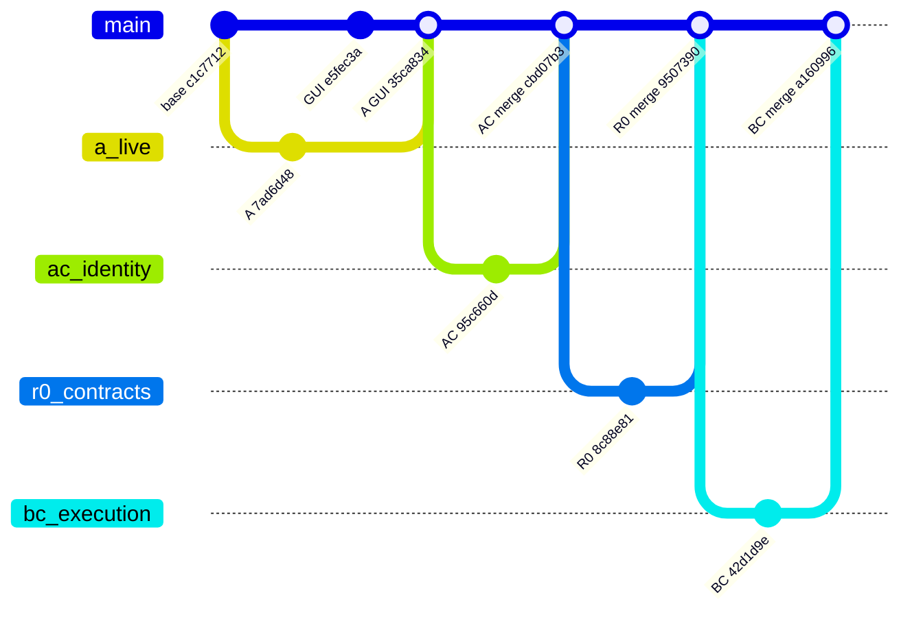
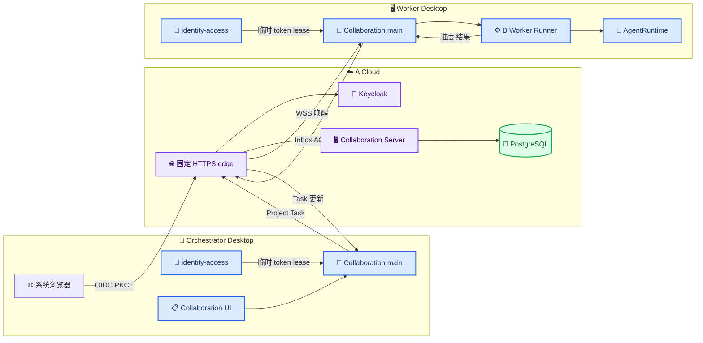
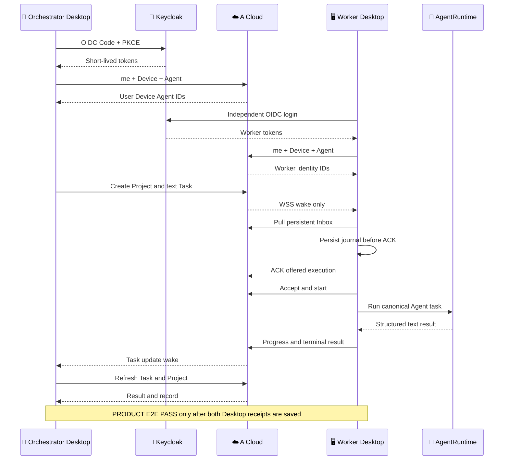

# SciForge Desktop—Cloud 多 Worker 端到端集成总账与验收计划

_集成分支 `integration/desktop-cloud-multi-worker-e2e-20260822` · 审计快照 2026-08-22 · 事实与计划严格分离_

---

## 📋 执行结论

### 事实（FACT）

当前集成分支已经把官方 GUI、A 云端合同与服务、AC Desktop OIDC、R0.1 portable contract，以及 BC Desktop Cloud 执行链合并为同一条源码路径；实现合并提交为 `a1609969903c761830c7ab90258b9251ed26a65d`。历史集成检查点 `9b5c0d1b7ca501bab669d2c3c4023abce54bbc82` 固定的是 schema v8；它的本地类型检查、协作回归、A 门禁、bundle、domain composition、capability governance、根级 typecheck、Electron build 与 lint 回执不能自动继承给正在形成的 Portal `NEW_COMMIT`。

这仍然不等于产品闭环已经完成。当前没有一份绑定该集成提交、两台真实 SciForge Desktop、两个不同 OIDC 主体、真实 AgentRuntime 执行和云端结果回显的 `PRODUCT E2E PASS` 回执。

云服务器的已知运行基线仍是 A 提交 `7ad6d48c3bd4c6eba23c90dda370c912e6950f49` 和 PostgreSQL schema v5。历史 `9b5c0d1b…` 检查点只包含连续 migration `0001`—`0008`（schema v8）；当前 Portal 工作树新增 `0009_portal_bounded_reads.sql`，最终目标 `NEW_COMMIT` 为 schema v9，但尚未提交、构建、安装或迁移到该 ECS。不得把历史 schema8 回执、本地 schema9 代码、A API harness 或 Keycloak 就绪回执描述成“Portal/最新版 Desktop 已上线”。

| 状态标签 | 含义 | 可否用于完成声明 |
| --- | --- | --- |
| `LIVE VERIFIED` | 来自当前实际环境的运行回执；必须绑定目标、时间与版本 | 仅证明回执明确覆盖的边界 |
| `SOURCE VERIFIED` | 精确提交中的源码、manifest 或生成物已审计 | 不能证明运行环境 |
| `LOCAL TESTED` | 精确工作树上的自动测试或构建通过 | 不能证明真实 Desktop 或公网 |
| `MERGED` | 变更已进入当前集成 Git 拓扑 | 不能证明已推送或部署 |
| `PENDING BUILD` | 最终提交或固定发布物尚未生成 | 不可宣告完成 |
| `PENDING MAINTENANCE` | 必须在维护窗口对 ECS 执行 | 不可宣告上线 |
| `PENDING PRODUCT E2E` | Cloud 已具备条件，但真实 Desktop 产品链尚未出回执 | 不可宣告产品闭环 |
| `PRODUCT E2E PASS` | 真实 Desktop、Cloud 和 AgentRuntime 全链路回执通过 | 可声明相应产品场景完成 |

### 计划（PLAN）

近期只关闭一个最小、可证伪的产品链路：两台电脑、一个 Orchestrator、一个 Worker、纯文本 Task。待它通过后，再扩展到一个 Orchestrator 加 2—8 个独立 Worker、E Content Space 文件流和人工确认。

## 🔍 审计范围、证据优先级与闭环定义

### 事实（FACT）

本次审计按以下优先级判断结论；低层证据不能替代高层证据：

1. 当前 ECS、Keycloak 和两台 Desktop 的新鲜运行回执
2. 绑定 exact commit 的固定 bundle、manifest、hash、image 与部署回执
3. exact commit 的源码、自动测试、构建和生成物
4. 当前架构与公共合同文档
5. 历史设计、OpenSpec checklist、Mock 和计划文档

从第一性原理看，“Desktop A 经 Cloud 指挥 Desktop B 并收到工作结果”只有同时满足以下条件才闭环：

| 不变量 | 必须证明的事实 | 当前状态 |
| --- | --- | --- |
| 身份独立 | Orchestrator 与 Worker 是不同 `issuer + sub`、不同 Cloud User、Device 和 Agent | `PENDING PRODUCT E2E` |
| 权威唯一 | Project、Task、execution、revision、Inbox 和 result 只以 A 为真值 | `SOURCE VERIFIED`、`LOCAL TESTED` |
| 投递持久 | WSS 只唤醒；Worker 从持久 Inbox 拉取、先落 journal、再连续 ACK | `LOCAL TESTED` |
| 执行真实 | Worker 通过唯一的 runtime-neutral `AgentRuntime` 运行，不用 mock 或第二套 runtime | `SOURCE VERIFIED`、`LOCAL TESTED` |
| 结果可见 | Worker progress/result 经 A 返回，Orchestrator Desktop 重新读取并显示 | `LOCAL TESTED` |
| 失效有效 | logout、Device revoke、旧 Agent credential 和旧 WSS 都失效 | A harness 为 `LOCAL TESTED`；产品真机待验 |
| 版本同一 | 两台 Desktop、A bundle 和验收证据绑定同一 `NEW_COMMIT` | `PENDING BUILD` |

文档源也按“当前合同”与“历史输入”区分：

| 级别 | 文档 | 本文如何使用 |
| --- | --- | --- |
| 当前约束 | [`AGENTS.md`](../../AGENTS.md)、[`docs/AGENTS.md`](../AGENTS.md) | 唯一生产路径与 AgentRuntime 边界 |
| 当前合同 | [A 公共 API](../collaboration-public-api.zh-CN.md)、[部署手册](../../deploy/collaboration-private/README.md)、[合同包说明](../../packages/collaboration-contracts/README.md) | API、发布、迁移与验收真值 |
| 当前上下文 | [Cloud Collaboration](../contexts/cloud-collaboration/CONTEXT.md)、[Identity and Access](../contexts/identity-access/CONTEXT.md)、[Provider Integration](../contexts/provider-integration/CONTEXT.md) | 统一术语与职责边界 |
| 当前实现 | [Collaboration](../../packages/domains/collaboration/README.md)、[Project Coordinator](../../packages/domains/project-coordinator/README.md)、[AgentRuntime](../agent-runtime-contract.md) | Desktop 产品链路 |
| 历史输入 | [A 旧就绪状态](../a-cloud-scope-and-readiness.zh-CN.md)、[BC 旧交付状态](../bc-final-design-and-delivery-status.zh-CN.md)、[旧用户指南](../collaboration-user-guide.zh-CN.md) | 追溯需求；旧状态不覆盖本文 |
| 设计历史 | [统一身份 OpenSpec](../../openspec/changes/add-a-unified-identity-device-bindings/design.md)、[统一协作 OpenSpec](../../openspec/changes/unify-user-device-collaboration/design.md)、[portable resource spec](../../openspec/specs/portable-resource-references/spec.md) | 解释设计来源；checkbox 不是 live receipt |

两个仓库外输入已按内容摘要冻结：

- `SciForge 多客户端协作 MVP 五人分工报告 (2).md`：SHA-256 `8f7e7597c5a2e189f72d176c5021c30ba5017a9583ec90bc6a3a3323b37ddbab`；其会议依据为两份团队对齐记录[^1][^2]
- `目前的问题.md`：SHA-256 `a52f5388fed604481bb192b081dad17c74c73f661caf7febb7b12dc9331ab144`

### 计划（PLAN）

每次部署或产品验收都新建一份不可变回执，并记录 `NEW_COMMIT`、bundle/hash、镜像 ID、数据库版本、主体/设备/Agent 的脱敏 ID、Task/execution ID、关键时间戳和结果。没有该回执时，状态保持 `PENDING`。

## 👥 初始 A—E 分工与当前收敛边界

### 事实（FACT）

| 板块 | 初始负责人和目标 | 当前唯一职责 | 本轮处理 |
| --- | --- | --- | --- |
| A | 阳寒辉；Cloud Collaboration Service 与首版总集成 | Cloud 权威状态、OIDC 验证、Device/Agent、Project/Task、Inbox/WSS、ResourceRef 元数据、发布与回滚 | 本文的部署主责 |
| B | 唐乃胜；Project Coordinator 工作流 | Coordinator 规划，以及归属 B 的 Worker Runner、journal/outbox、execution fence 和 AgentRuntime 调用 | 合并并验证，不部署独立服务 |
| C | 唐乃胜；Desktop/服务器节点接入 | Desktop Cloud transport、Agent credential、heartbeat、Inbox/ACK 和受限 `collaboration.bc-node` | 合并到 Collaboration domain |
| D | 陈季威；Computer Use 与 Human/IM 稳定性 | Computer Use、Zulip/Human endpoint 与跨端稳定性 | 不属于阶段一 A 闭环 |
| E | 张泽州；OpenContent 与 Content Space | portable reference 的本地解析、下载、上传、更新和 Provider 授权 | 阶段一显式禁用，阶段二接入 |

原分工报告还单列王学文负责统一登录与多端身份绑定。当前该成果已经由 `sciforge.identity-access` domain 统一承载：系统浏览器 Authorization Code + PKCE、严格 OIDC 校验、`/v1/me`、Device enrollment、Device revoke 和 Cloud Principal 都在该包内；C 的 Collaboration transport 只消费它发布的 main-only `identity.cloud-session`。

BC 后续边界已收敛：Worker Runner 属于 B；C 不保留第二套 Task adapter。D 和 E 的代码、部署和业务验收不由 A 接管。本轮为了跑 A 产品闭环，只合并它们对 A 所必需的公开消费端，不更改 D/E 的所有权。

### 计划（PLAN）

阶段一保持 Owner-direct：Owner 在 Desktop 明确创建 Project 和 Task，不启用自治 Coordinator，也不制造 `HumanNeeded`。阶段二才启用不可变确认、Human Provider、资源任务和多 Worker 调度；这些能力必须沿现有公共合同扩展，不新增旁路。

## 🔗 精确 Git 来源与合并拓扑

### 事实（FACT）

| 来源 | 固定引用 | SHA | 用途 |
| --- | --- | --- | --- |
| 官方 GUI | [`AGI4Sci/SciForge:gui`](https://github.com/AGI4Sci/SciForge/commit/e5fec3a3213cb476b6b2557f66725f3f347679a6) | `e5fec3a3213cb476b6b2557f66725f3f347679a6` | 当前官方 UI/Domain 基线 |
| A live | [`hanhuiyang5-web/SciForge`](https://github.com/hanhuiyang5-web/SciForge/commit/7ad6d48c3bd4c6eba23c90dda370c912e6950f49) | `7ad6d48c3bd4c6eba23c90dda370c912e6950f49` | ECS 当前 A 基线、schema v5 |
| A/GUI sync | [`sync/a-oidc-upstream-gui-20260821`](https://github.com/hanhuiyang5-web/SciForge/commit/7b837a3f9d3c5d7b512ae543f48f6dff145b9d4e) | `7b837a3f9d3c5d7b512ae543f48f6dff145b9d4e` | A 与旧共同 GUI 汇合 |
| AC identity | [`Nemophilist117/SciForge`](https://github.com/Nemophilist117/SciForge/commit/95c660dac565abe8f4e8e4a16f7f29d9a58e5d2f) | `95c660dac565abe8f4e8e4a16f7f29d9a58e5d2f` | Desktop OIDC/Device/Principal |
| R0.1 contracts | [`feat/a-r0-1-cloud-contracts`](https://github.com/hanhuiyang5-web/SciForge/commit/8c88e811b9ab0757c75e2c0a52c7e93c065ce496) | `8c88e811b9ab0757c75e2c0a52c7e93c065ce496` | portable contract 与 schema v8 |
| BC live integration | [`YOUessi/SciForge`](https://github.com/YOUessi/SciForge/commit/42d1d9ee016add5327103a715db8f100cc8a4593) | `42d1d9ee016add5327103a715db8f100cc8a4593` | Desktop transport、Worker 与结果链 |
| 历史集成检查点 | `integration/desktop-cloud-multi-worker-e2e-20260822` | `9b5c0d1b7ca501bab669d2c3c4023abce54bbc82` | 已提交 schema v8 总账；不是 Portal/schema9 `NEW_COMMIT` |

精确 merge parents 如下；该表而不是示意图是 Git 拓扑真值：

| Merge | 第一父提交 | 第二父提交 | 状态 |
| --- | --- | --- | --- |
| `35ca834a98dbda1295c58477af59a3a921d4bd88` | `7b837a3f9d3c5d7b512ae543f48f6dff145b9d4e` | `e5fec3a3213cb476b6b2557f66725f3f347679a6` | `MERGED` |
| `cbd07b3a4a8cf9e1fe17fcd5667c858b9cda17bd` | `35ca834a98dbda1295c58477af59a3a921d4bd88` | `95c660dac565abe8f4e8e4a16f7f29d9a58e5d2f` | `MERGED` |
| `9507390cb65d9be27522bb02d7ae2e4cf0993c7b` | `cbd07b3a4a8cf9e1fe17fcd5667c858b9cda17bd` | `8c88e811b9ab0757c75e2c0a52c7e93c065ce496` | `MERGED` |
| `a1609969903c761830c7ab90258b9251ed26a65d` | `9507390cb65d9be27522bb02d7ae2e4cf0993c7b` | `42d1d9ee016add5327103a715db8f100cc8a4593` | `MERGED` |

合并后又追加了测试组合修复 `7c33bb73f3a182672ed2f45e723d513ba13a7aeb`：它让生成脚本只通过 Content Space 公共导出消费合同，并为根级 Identity/host 测试补齐生产代码已要求的内部服务与设备上下文；没有放宽生产鉴权或增加第二套 runtime。



`packages/domains/project-coordinator/A_CONTRACT.md` 另外固定 A contract layer 为 `9507390cb65d9be27522bb02d7ae2e4cf0993c7b`，其重建 contracts tgz SHA-256 为 `1400f659eb3ad88624b716ebe7f484619c06240133b065df079c68d7d06eb8f0`。这是 B 的合同 pin，不是最终 ECS release hash。

### 计划（PLAN）

本文与最终必要修订提交后，以新的 40 位 HEAD 作为 `NEW_COMMIT`，非强制推送到用户 fork 的 `integration/desktop-cloud-multi-worker-e2e-20260822`。固定 A bundle、Desktop 构建和所有 E2E 回执都必须引用该 `NEW_COMMIT`，不能继续用 `a1609969` 代替最终提交。

## 🏗️ 当前产品架构、实现改动与 live 边界

### 事实（FACT）



| 区域 | 已合入的唯一实现 | 关键安全/产品边界 | 状态 |
| --- | --- | --- | --- |
| 登录 | system-browser OIDC Code + PKCE、严格 Token 校验、`/v1/me`、Device enrollment/revoke | Local Account 不是 Cloud 认证；Device 必须 `ACTIVE` | `MERGED`、`LOCAL TESTED` |
| Session | main-only `identity.cloud-session`，提供无 Token snapshot 与 fresh-token callback | 只允许 `sciforge.collaboration` 消费；操作前后 authority fence | `MERGED`、`LOCAL TESTED` |
| Transport | HTTPS command、WSS wake、durable inbox/outbox、receipt ledger | Token 不进 renderer、settings、B 或状态文件 | `MERGED`、`LOCAL TESTED` |
| Project UI | Owner 显式输入多个 member userId、Coordinator agentId 和 Worker agentId | 当前没有全局用户/Agent 枚举；ID 需带外复制 | `MERGED`、`LOCAL TESTED` |
| Worker | `task.offered` 先入 journal，随后唯一 `AgentRuntime` 执行并提交 progress/result | `(taskId, executionId)` 锁、幂等 outbox、每次写入 execution fence | `MERGED`、`LOCAL TESTED` |
| 阶段一内容 | Task 强制 `resourceRefIds=[]`、required refs 为空、authorization 为空 | 资源任务在 AgentRuntime 前持久拒绝；生产不使用 Mock Content Space | `MERGED`、`LOCAL TESTED` |
| 状态回显 | `task.updated`/`project_record` 触发重新读取；UI 显示进度、结果和安全失败摘要 | Cloud 仍是唯一真值 | `MERGED`、`LOCAL TESTED` |
| Domain 装配 | identity、collaboration、project-coordinator 走 manifest 与生成 composition | Host 无 domain ID switch、硬编码 session broker 或第二套 Task adapter | `MERGED`、`LOCAL TESTED` |

旧 `cloudIdentitySessionBroker`、C 内的旧 Task adapter、重复 connection/recovery 路径和生产 Mock Content Space 已删除。生产 composition 把自治 Coordinator 固定为 `false`；Agent work 只通过 runtime-neutral `AgentRuntime`，不会绕到 Codex 或 Claude 私有实现。

A 有两种不同的可视化界面，不能混为一谈：

| 界面 | 位置 | 用途 | 产品结论 |
| --- | --- | --- | --- |
| A 控制台 | Server bundle `/console/`，当前按 loopback/SSH 运维边界使用 | 直接检查 Project、Task、Inbox、record 和 ResourceRef 元数据；Bearer 仅存页面内存 | 运维/协议控制台，不是 Desktop 产品入口 |
| Collaboration Panel | SciForge Desktop domain renderer | 登录后创建 Project/Task、查看连接、进度、结果和恢复状态 | 阶段一产品入口 |

当前 ECS/Keycloak 信息来自 2026-08-22 的 A-only 只读 SSH/公网审计与操作方确认；本轮集成和文档工作没有修改、重启或部署服务器，因此只在回执明确边界内标为 `LIVE VERIFIED`：

| 项目 | 当前回执 | 边界 |
| --- | --- | --- |
| A fixed release | `7ad6d48c3bd4c6eba23c90dda370c912e6950f49`，schema v5 | 不是本集成提交 |
| Cloud health | `cloud-test.sciforge.cn/healthz` 返回 `200` | 不证明 Desktop E2E |
| Keycloak | 26.7.0，`start --optimized`；Keycloak 与 PostgreSQL healthy | Keycloak owner 范围 |
| Issuer | `https://login-test.sciforge.cn/realms/SciForge` | exact issuer |
| JWKS | RSA 2048、RS256、非空 `kid` | 不包含 Token 内容 |
| OIDC client | audience `sciforge-cloud-api`，authorized party `sciforge-desktop` | 真实 Desktop claims 待产品验收 |
| Identity edge | `sciforge-keycloak_identity-edge`；固定 upstream `keycloak:8080`；Keycloak DB 不加入 | A edge 只消费窄网络 |
| 代理信任 | public hostname strict；`xforwarded`；只信任预留 A edge `172.24.0.3` | 未使用 `KC_HOSTNAME_STRICT=false` |
| 公网规则 | TCP 443 允许，TCP 80 拒绝；8080、9000、5432 不发布宿主端口 | 维护开始时需暂关 443 |
| Keycloak Compose | SHA-256 `0dfdf4b4d89ac90d9b2a9d1dd089f637778590f9e90980d1b4f50a386ccea437` | 不是 A release manifest hash |
| 重启恢复 | Keycloak 约 32 秒恢复 healthy；realm、用户、client、mapper、Discovery/JWKS 保持 | 不替代新 A 发布重启门禁 |

当前仓库 `compose.a-https-oidc-test.yml` 的源码 SHA-256 为 `be1e93dc33a38566aedb1f28b81e416b3f549915f5915a7c5d70ea830499c713`。它与 Keycloak Compose 的 `0dfd…` 是不同文件；二者不得互相冒充。

### 计划（PLAN）

下一次维护窗口把 A 从 `7ad/schema5` 原子升级到绑定最终 Portal `NEW_COMMIT` 的 schema v9 fixed release。历史 `9b5c0d1b/schema8` 只作为来源检查点，不能作为本次发布物或数据库 attestation。在这之前不修改 live ECS，不把工作树直接覆盖现网，也不让旧 app 连接已迁移数据库。

## 🎯 阶段一双机闭环与阶段二多 Worker 目标

### 事实（FACT）

两台电脑足以验收阶段一：一个 Orchestrator Desktop 加一个 Worker Desktop。当前源码已经具备所需产品入口和执行路径，但尚无真实回执。



阶段一固定边界：

- 两个不同 OIDC 主体、两个 Cloud User、两个 ACTIVE Device 和两个 Agent
- Owner-direct Project/Task；不中途请求用户批准，不启用自治 Coordinator
- 一个纯文本 Task；不携带 ResourceRef、文件、外部授权或输出文件名
- Worker 必须真正调用本机已选 Codex 或 Claude `AgentRuntime`
- WSS 只唤醒；持久 Inbox、journal、ACK、progress、result 和 UI 回显缺一不可
- 结束后撤销 Worker Device，并证明旧 Agent credential 与 WSS 失效

### 计划（PLAN）

阶段一验收步骤：

1. 在两台机器安装同一 `NEW_COMMIT` 构建的 SciForge
2. 分别通过系统浏览器登录 Orchestrator 与 Worker 测试账号
3. 分别完成 Device enrollment 和 Agent registration
4. 从 Worker Desktop 复制 `userId` 与 `agentId`，通过受信带外方式交给 Orchestrator
5. Orchestrator Panel 创建 Project，成员包含双方，Coordinator 选本机 Agent
6. Orchestrator 创建纯文本 Task，并把 assignee 指向 Worker Agent
7. 不做人工干预，等待 Worker durable Inbox、AgentRuntime、progress 与 result
8. Orchestrator Panel 必须显示相同 Task 的终态、结果摘要和 record ID
9. 重连后再次读取，证明 execution 未重复运行、结果未丢失
10. 撤销 Worker Device，证明旧 credential/WSS 立即被拒绝

阶段二不是“在同一进程伪造两个 Worker”。一个 Orchestrator 加 2—8 个 Worker 至少需要三个不同 OIDC 主体、三个 ACTIVE Device/Agent 执行身份和隔离的本地状态；第三个执行身份可以来自另一台物理机或独立 VM/用户 profile，但不能复用同一 Device、Agent credential 或 secret store。

阶段二再增加：

- 同一 Project 向 2—8 个 Worker 派发各自独立 Task，并行验证 Inbox/ACK/result
- 一项 Task 同一时刻仍只有一个 assignee；retry/reassign 必须产生新的 execution fence
- 接入 E 的 portable ResourceRef、materialize/download/upload/update 和冲突前置条件
- 启用绑定不可变 proposal digest 的人工确认、重派/取消和最终结论确认
- 需要时接入 D 的 Human Provider/Zulip，但不得把手机当 Worker

当前明确卡点不是本地编译，而是运行证据：

| 卡点 | 影响 | 解除条件 |
| --- | --- | --- |
| ECS 仍为 `7ad/schema5` | Portal `NEW_COMMIT` 与 schema v9 合同不能作为同版验收 | fixed release 维护发布通过 |
| 最终 `NEW_COMMIT`/bundle 尚未生成 | 无法冻结 Desktop 与 Cloud 同版 | 文档提交后 clean build |
| 无真实双 Desktop receipt | 不可声明产品闭环 | 完成阶段一 10 步 |
| Worker ID 依赖带外复制 | 可跑，但产品易用性有限 | 后续设计不可枚举 invitation |
| 资源任务生产拒绝 | 无法测试文件协作 | E 正式 port 接入后解除 guard |
| 自治 Coordinator 固定关闭 | 无自动拆解/确认链 | 阶段二单独评审并启用 |
| 真实 1+2 Worker 未验 | 不可声称多 Worker 产品能力 | 三个独立主体/Device/Agent 回执 |

## 🧪 自动门禁与真实验收矩阵

### 事实（FACT）

以下协作、构建和生成物回执首先绑定实现合并 `a1609969903c761830c7ab90258b9251ed26a65d`；根级 Vitest 在测试组合修复 `7c33bb73f3a182672ed2f45e723d513ba13a7aeb` 上重新执行，并最终记录在历史 `9b5c0d1b/schema8` 总账。它们是 Portal `NEW_COMMIT/schema9` 的历史输入，不是当前发布通过回执：

| 门禁 | 实证结果 | 状态 | 说明 |
| --- | --- | --- | --- |
| `npm run collaboration:typecheck` | 通过 | `LOCAL TESTED` | 六个协作相关 package |
| `npm run collaboration:test` | contracts 106、identity 4、provider 33、server 606 通过/6 skip、domain 44、coordinator 27、canonical 20 | `LOCAL TESTED` | 包含 managed locator 修复后的全回归 |
| `npm run collaboration:a:test` | 通过；identity acceptance 11、multi-worker acceptance 18 | `LOCAL TESTED` | A server harness，不是 Desktop product E2E |
| `npm run collaboration:bundle:test` | 22 通过 | `LOCAL TESTED` | 固定 bundle builder |
| `static-policy-test.sh` | 通过 | `LOCAL TESTED` | 部署脚本与边界策略 |
| `domain-packages:check` | 27 个 package 通过 | `LOCAL TESTED` | 生成 composition 新鲜 |
| `smoke:domain-packages:tarball` | 通过 | `LOCAL TESTED` | clean-runner package 消费 |
| `capability:check` | 248 actions、25 policies 通过 | `LOCAL TESTED` | 生成 capability registry 新鲜 |
| 根级 `npm run typecheck` | 通过 | `LOCAL TESTED` | 全仓类型边界 |
| `npm run build` | Electron build 通过 | `LOCAL TESTED` | main/preload/renderer 组合 |
| 根级 `npx vitest run` | 365 files、3294 tests 全部通过 | `LOCAL TESTED` | 合并后应用级组合回归 |
| 根级 `npm test` | exit 0；全部 pretest、27 个 domain package 与根级 3294 tests 通过 | `LOCAL TESTED` | 在 `7c33bb73…` 上重新执行的全仓回归 |
| lint | 0 error、1 个既有 `ImageWorkspaceViewer` warning | `LOCAL TESTED` | warning 不来自本次协作合并 |

### 计划（PLAN）

最终 `NEW_COMMIT` 形成后必须重跑 release-critical 门禁；文档提交本身不会自动继承 `a1609969` 的测试回执。

| 层级 | 必跑项 | 出口证据 | 完成状态 |
| --- | --- | --- | --- |
| Final source | collaboration、A、bundle、static、domain、capability、root typecheck/build/lint | 命令、exit code、commit | `PENDING BUILD` |
| Fixed artifact | Portal manifest schema 4、十文件 bundle（五个 tgz）、九项 `SHA256SUMS`、archive sidecar | hash 清单 | `PENDING BUILD` |
| PostgreSQL | backup/restore、隔离 v9、十个 0009 index、三项 hard cap、迁移、restart | 兼容命名 attestation 与脱敏 receipt | `PENDING MAINTENANCE` |
| Local edge | TLS/SNI、issuer/JWKS、health、WSS、网络/端口 | local verifier receipt | `PENDING MAINTENANCE` |
| External edge | 独立公网 resolver/network 的 fixed verifier | external receipt | `PENDING MAINTENANCE` |
| A real-token | 1 Orchestrator + 2 Worker API/WSS harness | A service receipt | `PENDING MAINTENANCE` |
| Product phase one | 两台真实 Desktop、1+1、真实 AgentRuntime | `PRODUCT E2E PASS` receipt | `PENDING PRODUCT E2E` |
| Product phase two | 1+2—8、E resource、Human confirmation | 扩展 receipt | 后续阶段 |

## 🚀 固定发布、部署、验证与回滚 runbook

### 事实（FACT）

历史 `9b5c0d1b/schema8` 的 `a-https-oidc-test` 合同是 manifest schema 3、四个 tgz、九文件 bundle；它不能作为 Portal 发布物。Portal `NEW_COMMIT` 的固定合同升级为 manifest schema 4、五个 tgz、十文件 bundle，`SHA256SUMS` 精确覆盖其余九个输入，并新增 Portal package/asset inventory、独立 `sciforge-cloud-console` party、redirect/CSP/feature flag 以及 20 个 ECS 资产摘要。archive 仍需另有可信侧 SHA-256；最终 hash 只能从 clean `NEW_COMMIT` 构建生成。

当前 live A 是 `7ad/schema5`；历史 `9b5c0d1b` 从 server tarball 连续推导 `0001`—`0008`（schema v8）；Portal `NEW_COMMIT` 再加入 `0009_portal_bounded_reads.sql` 并要求 schema v9。文件名仍为 `verify-postgres-v5-integration.sh`，`/run/...postgres-v5.attestation` 及既有 handoff 的 `POSTGRES_V8_ATTESTATION` 字段也为兼容自动化保留，但当前门禁和字段值必须证明 schema v9；任何兼容名称都不能被解释成只测 v5/v8。

### 计划（PLAN）

#### 维护前：冻结源码与发布物

```bash
git fetch upstream refs/heads/gui:refs/remotes/upstream/gui
test -z "$(git status --porcelain=v1 --untracked-files=all)"
NEW_COMMIT="<replace-with-final-40-character-commit>"
test "$NEW_COMMIT" = "$(git rev-parse HEAD)"
git merge-base --is-ancestor upstream/gui "$NEW_COMMIT"

npm ci
npm run collaboration:a:typecheck
npm run collaboration:a:test
npm run collaboration:bundle:test
bash deploy/collaboration-private/scripts/static-policy-test.sh
npm run collaboration:bundle -- \
  --a-https-oidc-test \
  --commit "$NEW_COMMIT" \
  --output "<trusted-artifact-directory>/release"
```

随后按[部署手册](../../deploy/collaboration-private/README.md)从 exact commit `git archive` 部署树，把十个 bundle 文件装入 archive；记录：

- `NEW_COMMIT`
- `RELEASE_MANIFEST.json` SHA-256
- `SHA256SUMS` SHA-256 及逐项校验结果
- archive SHA-256 与独立记录位置
- identity/multi-worker harness SHA-256
- 所有发布脚本的 Git mode 与落盘 mode

#### 维护窗口：数据库与 app

1. 宣布无业务写入窗口，先暂时关闭安全组公网 TCP 443；TCP 80 保持拒绝
2. 从旧 `7ad` fixed release 运行 `disable-a-https-oidc-test.sh`，确认宿主和 Docker 无 443 listener
3. 对 schema v5 生产库执行 `backup.sh`，立即运行 `verify-backup-restore.sh`，把 dump/sidecar 复制到加密异机存储
4. 把新 archive 以 root-only 流程安装到 `/srv/sciforge-collaboration/releases/<NEW_COMMIT>/`
5. 运行隔离 schema v9 门禁；除证明 0004 的 NULL ProjectRecord 作者可从记录之后第一条 accepted `agent.owner.transfer` 的旧 owner actor 安全回填（Task assignee User 即使被所有权转移级联改写也不能作为历史真值）、多次转移选择第一条、相同时间戳歧义 fail closed、转移前的非空历史作者不被改写、作者列最终为 `NOT NULL` 外，还要证明历史数据未超过“每 User 1000 个 active Project membership、每 Project 50000 条 record、每 Project 10000 条 HumanNeeded”的 fixed cap，并要求回执同时列出十个 `0009` bounded-read index：`agent_nodes_active_owner_agent_idx`、`human_answers_project_created_answer_idx`、`human_requests_project_target_request_id_idx`、`oidc_identities_active_user_issuer_idx`、`project_members_active_project_user_idx`、`project_members_active_user_project_idx`、`project_records_candidate_task_result_project_idx`、`project_records_project_record_id_idx`、`tasks_active_assignee_idx`、`tasks_project_task_id_idx`。

```bash
sudo "/srv/sciforge-collaboration/releases/$NEW_COMMIT/deploy/collaboration-private/scripts/verify-postgres-v5-integration.sh" \
  "$NEW_COMMIT" \
  /srv/sciforge-collaboration/secrets/collaboration.env \
  --confirm-isolated-database-test
```

6. 只有 attestation 与 index receipt 通过后才运行 app 部署；它会消费兼容命名的 attestation、备份、迁移 v5→v9、启动并验证：

```bash
sudo "/srv/sciforge-collaboration/releases/$NEW_COMMIT/deploy/collaboration-private/scripts/deploy.sh" \
  "$NEW_COMMIT" \
  /srv/sciforge-collaboration/secrets/collaboration.env
```

7. 运行 OIDC 模式 PostgreSQL restart 验收：

```bash
sudo "/srv/sciforge-collaboration/releases/$NEW_COMMIT/deploy/collaboration-private/scripts/verify-postgres-restart.sh" \
  "$NEW_COMMIT" \
  /srv/sciforge-collaboration/secrets/collaboration.env \
  --confirm-postgres-restart \
  --a-https-oidc-test
```

#### 维护窗口：edge 与公网验收

1. 再确认 Keycloak upstream 为 `keycloak:8080`、issuer/JWKS 正确、identity-edge 无数据库
2. 只重新开放公网 TCP 443；80、UDP 443、8080、8787、9000、5432 保持不公开
3. 部署候选 edge；脚本本地门禁通过后才把 restart policy 切为 `unless-stopped`：

```bash
sudo "/srv/sciforge-collaboration/releases/$NEW_COMMIT/deploy/collaboration-private/scripts/deploy-a-https-oidc-test.sh" \
  "$NEW_COMMIT" \
  /srv/sciforge-collaboration/secrets/collaboration.env
```

4. 只读取窄字段核对 edge 在 `sciforge-keycloak_identity-edge` 的实际 IPv4 精确为 Keycloak 已信任的 `172.24.0.3`，并记录进回执；不要粘贴完整 `docker inspect`
5. 从独立公网网络运行 manifest 绑定的 `verify-a-https-oidc-test-external.sh`
6. 用 owner 与两个 Worker 的 fresh、`0600` Token 文件运行 A multi-worker harness；该回执只证明服务端合同
7. 安装同一 `NEW_COMMIT` Desktop 构建并执行阶段一双机产品验收

本机 AAAA resolver、代理或热点异常不能通过降低 TLS/DNS 要求解决。独立 verifier 必须在启动前清除 Node preload、代理和自定义 CA 变量，并验证 manifest 中固定的 verifier hash；如果当前网络无法提供可信 DNS，就换一条独立网络运行同一 verifier，而不是跳过盖章。

#### 回滚入口

回滚不是“把旧容器再启动”。schema v9 没有 down migration，旧 `7ad/schema5` app 不得直接连接已迁移数据库。

1. 立即关闭安全组公网 TCP 443
2. 从当前候选 fixed release 运行零参数 `disable-a-https-oidc-test.sh`
3. 停止候选 app，保留容器日志、release、image、backup 与数据库现场
4. 若只需 edge/Portal 止血，保持 schema9-compatible app loopback、关闭 Portal/公网 edge，排查后重新执行新 release 的完整门禁
5. 若需回退到 `7ad/schema5`，在新 volume/隔离数据库恢复维护前 v5 dump，验证 restore、表集与 row count 后，再部署旧 fixed release；不得覆盖唯一生产 volume
6. 恢复 core-only 时必须使用空 issuer profile、重新部署 app 并跑旧 core-only 本地/外部门禁；不能只替换 Caddy
7. Keycloak、realm、用户、client、mapper 与 Keycloak PostgreSQL 不由 A 回滚脚本修改

## 🔐 证据、secret 边界与 A fixed edge 交付块

### 事实（FACT）

以下内容永远不能进入 Git、聊天、receipt、manifest、Task、ProjectRecord、日志或 screenshot：

- OIDC access/refresh token、完整 claims、密码和浏览器授权 code
- Device 私钥、Agent credential、pairing poll secret 和 binding code
- Provider/OpenContent/Zulip token 与连接 secret
- PostgreSQL 管理员密码、应用数据库密码和完整认证 URL
- 本地绝对路径、workspace 正文和未脱敏文件内容

`identity.cloud-session` 的公共 snapshot 只含 `cloudBaseUrl`、`userId`、`deviceId`、过期时间和 authority generation；Token 仅在 main-process fresh-token callback 内短暂存在。A 只保存协作元数据和结构化短结果，不保存文件正文。

外部 A harness 的 owner/Worker token、revoke token 和 descriptor 都必须是当前用户拥有、非 symlink、absolute path、精确 `0600` regular file；descriptor 只能引用两个 token 文件路径。receipt 只记录脱敏 ID、状态、时间、hash 和计数。

源码固定的脚本权限如下；final archive 与 ECS 安装后仍需重新 `stat`：

| 文件类别 | Git mode | 维护窗口要求 |
| --- | --- | --- |
| `common.sh`、Caddyfile、Compose、Dockerfile、`.dockerignore` | `100644` | root-owned，group/other 不可写 |
| deploy/disable/verify/backup/restart/static shell | `100755` | root-owned，必须可执行且 group/other 不可写 |
| `postgres-v5-integration.mjs`、PostgreSQL init | `100755` | root-owned，必须可执行且 group/other 不可写 |
| incoming archive/sidecar | 不入 Git | `root:root/0600`，父目录 `0700` |

Caddy image 已在源码固定为 `caddy:2.11.4-alpine@sha256:98eb57d882ccd5213d1688764db10c1ca2c58a1ca3a6717a3411ad798f7a423a`。runtime image ID、edge container image ID 和 `org.opencontainers.image.revision` 必须在维护窗口从实际 Docker 对象记录，不能从 tag 推断。

### 计划（PLAN）

下列交付块可以直接发给 Keycloak 同学；`PENDING_FINAL_COMMIT`、`PENDING_BUILD`、`PENDING_MAINTENANCE` 与 `PENDING_PRODUCT_E2E` 必须分别在对应阶段从 exact commit、可信构建物、实际运行对象或真实 Desktop 回执生成后原样替换，不能预填、猜测或沿用旧 release：

```text
【SciForge A 固定 OIDC edge 交付块｜2026-08-22】

范围：a-https-oidc-test 测试环境，非生产；A 只负责 TLS/SNI 与 Cloud/Keycloak 窄反代，不管理 Keycloak realm、client、用户或数据库。

已完成 / 已冻结：
- IMPLEMENTATION_MERGE=a1609969903c761830c7ab90258b9251ed26a65d
- HISTORICAL_INTEGRATION_CHECKPOINT=9b5c0d1b7ca501bab669d2c3c4023abce54bbc82（schema8；不是 Portal 发布提交）
- LIVE_A_BASELINE=7ad6d48c3bd4c6eba23c90dda370c912e6950f49
- LIVE_DB_SCHEMA=5
- CANDIDATE_DB_SCHEMA=9
- CONTRACT_ARTIFACT_DATABASE_SCHEMA=9
- CANDIDATE_DB_MIGRATION=0009_portal_bounded_reads.sql
- CANDIDATE_DB_INDEX_SET=agent_nodes_active_owner_agent_idx,human_answers_project_created_answer_idx,human_requests_project_target_request_id_idx,oidc_identities_active_user_issuer_idx,project_members_active_project_user_idx,project_members_active_user_project_idx,project_records_candidate_task_result_project_idx,project_records_project_record_id_idx,tasks_active_assignee_idx,tasks_project_task_id_idx
- CANDIDATE_DB_HARD_CAPS=active_project_memberships_per_user:1000,project_records_per_project:50000,human_needed_per_project:10000（create/add/reactivate 以稳定 User 顺序取得事务 advisory lock；record/HumanNeeded 在 Project row lock 内 count-and-insert）
- OIDC_ISSUER=https://login-test.sciforge.cn/realms/SciForge
- OIDC_AUDIENCE=sciforge-cloud-api
- OIDC_DESKTOP_AZP=sciforge-desktop
- PORTAL_OIDC_AZP=sciforge-cloud-console（独立 Portal verifier；不加入公共 /v1 allowlist）
- PORTAL_REDIRECT_URI=https://cloud-test.sciforge.cn/portal/auth/callback
- IDENTITY_EDGE_NETWORK=sciforge-keycloak_identity-edge
- KEYCLOAK_UPSTREAM=keycloak:8080
- KEYCLOAK_DB_ON_IDENTITY_EDGE=false
- KEYCLOAK_TRUSTED_EDGE_IP=172.24.0.3
- PUBLIC_TCP_443=allow
- PUBLIC_TCP_80=deny
- KEYCLOAK_COMPOSE_SHA256=0dfdf4b4d89ac90d9b2a9d1dd089f637778590f9e90980d1b4f50a386ccea437
- A_OIDC_EDGE_COMPOSE_SOURCE_SHA256=be1e93dc33a38566aedb1f28b81e416b3f549915f5915a7c5d70ea830499c713
- HISTORICAL_9B5_A_CONTRACT_TGZ_SHA256=1400f659eb3ad88624b716ebe7f484619c06240133b065df079c68d7d06eb8f0（不得用于 Portal NEW_COMMIT）
- RELEASE_MANIFEST_SCHEMA=4
- CADDY_IMAGE=caddy:2.11.4-alpine@sha256:98eb57d882ccd5213d1688764db10c1ca2c58a1ca3a6717a3411ad798f7a423a
- SCRIPT_MODE=deploy/disable/verify/backup/restart/static/postgres-runner 0755；common.sh/Caddyfile/Compose/Dockerfile/.dockerignore 0644；collaboration.env 0600；archive/sidecar 0600；ECS 资产 root-owned 且 group/other 不可写

需在最终提交与可信构建机生成 / 回填：
- NEW_COMMIT=PENDING_FINAL_COMMIT
- RELEASE_MANIFEST_SHA256=PENDING_BUILD
- SHA256SUMS_SHA256=PENDING_BUILD
- TRUSTED_ARCHIVE_SHA256=PENDING_BUILD
- PORTAL_TGZ_SHA256=PENDING_BUILD
- PORTAL_ASSET_INTEGRITY_SHA256=PENDING_BUILD
- IDENTITY_ACCEPTANCE_HARNESS_SHA256=PENDING_BUILD
- MULTI_WORKER_ACCEPTANCE_HARNESS_SHA256=PENDING_BUILD

需在维护窗口从实际对象生成 / 回填：
- RUNTIME_IMAGE_ID=PENDING_MAINTENANCE
- RUNTIME_IMAGE_REVISION_LABEL=PENDING_MAINTENANCE
- EDGE_IMAGE_ID=PENDING_MAINTENANCE
- EDGE_CONTAINER_ID=PENDING_MAINTENANCE
- EDGE_IDENTITY_IPV4=PENDING_MAINTENANCE（必须精确为 172.24.0.3）
- IMAGE_SEAL_RECEIPT=PENDING_MAINTENANCE（runtime/edge image ID、revision、container ID、approval marker 窄字段）
- POSTGRES_V8_ATTESTATION=PENDING_MAINTENANCE（兼容字段名保留；值必须绑定 NEW_COMMIT/schema9）
- POSTGRES_V9_INDEX_RECEIPT=PENDING_MAINTENANCE（必须含十个固定 index 及三项 hard cap）
- BACKUP_RESTORE_RECEIPT=PENDING_MAINTENANCE
- POSTGRES_RESTART_RECEIPT=PENDING_MAINTENANCE
- LOCAL_EDGE_VERIFY_RECEIPT=PENDING_MAINTENANCE
- INDEPENDENT_EXTERNAL_VERIFY_RECEIPT=PENDING_MAINTENANCE
- A_REAL_TOKEN_MULTI_WORKER_RECEIPT=PENDING_MAINTENANCE

需在两台真实 Desktop 生成 / 回填：
- TWO_DESKTOP_PRODUCT_E2E_RECEIPT=PENDING_PRODUCT_E2E

部署验证出口：
- cloud-test health/ready、双 SNI TLS、exact issuer/JWKS、revision header、WSS/Origin 拒绝、Provider catalog 空、binding confirm fail-closed、identity-edge 精确成员、edge IPv4=172.24.0.3、公开端口边界全部通过。
- A real-token harness 与 Desktop product E2E 分开出回执；前者不得冒充后者。

回滚入口：
1. 先关闭安全组公网 TCP 443。
2. 从当前 fixed release 运行 disable-a-https-oidc-test.sh。
3. 保留候选容器、日志、image、release、backup 与数据库现场。
4. edge/Portal 止血可保持 schema9-compatible 新 app loopback并关闭 Portal；回退 7ad/schema5 必须把维护前 v5 dump 恢复到新 volume/隔离数据库并验证，禁止旧 app 直连 schema9。
5. A 回滚不修改 Keycloak、realm、client、用户、mapper 或 Keycloak PostgreSQL。
```

只有 `PENDING_FINAL_COMMIT`、`PENDING_BUILD`、`PENDING_MAINTENANCE` 全部产生，且 `PENDING_PRODUCT_E2E` 的双 Desktop 回执通过后，本文状态才可更新为 `PRODUCT E2E PASS`。A 服务端 1+2 Worker harness 通过时，只能声明 A API/WSS/Inbox/撤销合同闭环。

## 📚 References

- [A 云端协作最小公共 API](../collaboration-public-api.zh-CN.md)
- [A private/OIDC fixed release 部署手册](../../deploy/collaboration-private/README.md)
- [Collaboration contracts](../../packages/collaboration-contracts/README.md)
- [Identity Access PR 验收记录](../identity-access-pr78-acceptance-receipt.md)
- [Project Coordinator A contract pin](../../packages/domains/project-coordinator/A_CONTRACT.md)
- [Project Coordinator 与 Worker Runner](../../packages/domains/project-coordinator/README.md)
- [Collaboration Desktop domain](../../packages/domains/collaboration/README.md)
- [AgentRuntime contract](../agent-runtime-contract.md)
- [Portable resource reference spec](../../openspec/specs/portable-resource-references/spec.md)
- [官方 SciForge 仓库](https://github.com/AGI4Sci/SciForge)
- [用户 fork](https://github.com/hanhuiyang5-web/SciForge)
- [AC fork](https://github.com/Nemophilist117/SciForge/tree/codex/ac-identity-entry)
- [BC fork](https://github.com/YOUessi/SciForge/tree/codex/bc-cloud-live-integration)

---

_最后更新：2026-08-22 · 本文是集成与验收总账；运行结论以 exact commit 的新鲜回执为准。_

[^1]: SciForge Team. (2026). “SciForge 云端协作 PoC 分工对齐会发言记录.” Feishu. https://ecnw9f4vkfa6.feishu.cn/docx/QzmUdeRxmoQ80yxJziqc8TBzn4f

[^2]: SciForge Team. (2026). “SciForge 云端协作 PoC 分工对齐会会议记录（草案）.” Feishu. https://ecnw9f4vkfa6.feishu.cn/docx/C15WdoUzmomLchxvHBmcfSwInvp
