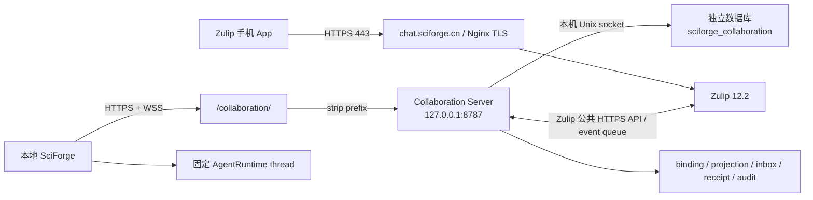

# SciForge 协作服务既有 47.243 ECS 运行记录与运维手册

> [!WARNING]
> 本文记录的是 `47.243.145.156` 上既有（legacy）Zulip 与旧协作服务的 2026-08-15 运行基线。它不能证明新 A ECS `47.76.230.118` 已接管协作服务，也不能证明新 A 的固定 commit、数据库或合同已经通过公网路径。迁移期间必须把两套部署、数据和凭据视为彼此独立。
>
> 新 A 的正式入口、Human Provider、Zulip 是否参与以及 A 与本地最新版 SciForge 之间的消息方向均尚未形成经团队确认的方案。`https://chat.sciforge.cn/collaboration/` 只表示本文记录的 legacy 服务地址，不是新 A 的 canonical 目标，也不能据此推导未来产品链路。

> 状态基线：2026-08-15（Asia/Shanghai）
>
> 适用规模：约 6 名用户
>
> Zulip：`https://chat.sciforge.cn`
>
> legacy 协作服务：`https://chat.sciforge.cn/collaboration/`（仅作历史运行记录）

本文主要保留 legacy 环境的源码开发启动、生产部署、升级、恢复和历史端到端验收记录；其中“当前”“已通过”等表述均以 `47.243.145.156` 的上述日期基线为范围，不自动适用于新 A ECS。用户配对、Session 投影和手机验收步骤见
[手机与多人协作使用手册](../collaboration-user-guide.zh-CN.md)。本文中的尖括号均为占位符；不得把密码、
API key、私钥、长期 token、一次性配对码或数据库连接凭据复制到本文、Git、聊天或工单。

## 1. 当前基线与发布门槛

2026-08-15 对 legacy `47.243.145.156` 的只读部署审计确认：该香港 ECS 正常运行，根分区使用约 27%，可用内存约 1.3 GiB、swap
4 GiB，Nginx 与 PostgreSQL active；现有 Zulip 12.2 和 `https://chat.sciforge.cn` 继续提供登录与消息
服务。协作服务使用独立进程、数据库、权限和发布目录，不修改或读取 Zulip 内部数据库。

| 项目 | 2026-08-15 已核验状态 | 后续发布或验收仍须检查 |
| --- | --- | --- |
| DNS / TLS / Zulip | 原路径 `/` 返回 302、Zulip API 返回 200 | 登录、消息和证书不回归 |
| Nginx 扩展点 | `/etc/nginx/zulip-include/app.d/*.conf` 已启用路径反代 | `nginx -t` 成功且公开探针可达 |
| Collaboration Server | release `20260815T125817Z`；service active、restart 0 | unit active、restart 无异常 |
| 数据库 | schema version 1、25 张表 | migration 成功且 `readyz` 为 200 |
| 探针与认证边界 | loopback/public `healthz`、`readyz` 均为 200；未认证 WebSocket 为 401 | 内外网探针与未认证拒绝均不回归 |
| 备份 | 最近备份 checksum 通过；timer active/enabled；结果 success | 异机复制、隔离恢复演练仍需完成 |
| 日志 | service/migrate/backup 的敏感模式匹配计数均为 0 | 只看安全摘要，不输出环境或请求头 |
| 单用户真实双向闭环 | **已通过**：手机 → 固定桌面 Session → 手机、桌面 → 手机；唯一标记和最终回复各一次 | 继续执行离线、重启、撤销和审批的生产抽测 |
| 六用户正式验收 | OpenSpec 任务 10.3 **仍未完成** | 必须由六个真实账号、手机和 Agent 完成第 14.2 节 |

基础设施部署健康和单用户双向闭环通过，不等于六用户协作验收完成。以下任一项失败都不得宣告对应阶段
完成：数据库迁移、packed CLI 启动、私密文件权限、Nginx 配置检查、内外网 readiness、真实 Zulip
收发或固定桌面 Session 验收；Fake provider 和本地 driver 结果不能替代真实手机/桌面验收。

## 2. 开发环境从源码启动

### 2.1 前置与隔离原则

开发机需要 Node.js `>=22.12.0`、npm 和 PostgreSQL。只使用独立开发数据库与专用 Zulip 测试
Bot/channel；不得连接生产数据库、复用生产 Bot 或把 `.env`、provider credential 提交到仓库。

先安装依赖、创建由当前本机 PostgreSQL 用户持有的空数据库，再显式迁移：

```sh
npm ci
createdb sciforge_collaboration_dev

export SCIFORGE_COLLABORATION_DATABASE_URL='postgresql:///sciforge_collaboration_dev'
export SCIFORGE_COLLABORATION_LISTEN_HOST='127.0.0.1'
export SCIFORGE_COLLABORATION_LISTEN_PORT='8787'
export SCIFORGE_COLLABORATION_BASE_PATH=''
unset SCIFORGE_COLLABORATION_PROVIDER_CONFIG_FILE
unset SCIFORGE_COLLABORATION_SECRET_DIRECTORY

npm --workspace @sciforge/collaboration-contracts run build
npm --workspace @sciforge/collaboration-provider-zulip run build
npm --workspace @sciforge/collaboration-server run build
npm --workspace @sciforge/collaboration-server run migrate
npm --workspace @sciforge/collaboration-server run start
```

`postgresql:///...` 使用开发机的默认本地 socket/账号，不含口令；若本机 PostgreSQL 配置不同，应在
终端外的受限配置中提供一个最小权限开发连接串，不要写进仓库或命令历史。上述 core-only 启动刻意让
两个 provider 环境变量同时保持未设置；只设置其中一个会 fail closed。直接访问开发服务时不使用生产
`/collaboration` 前缀。

另开终端验证：

```sh
curl --fail --silent --show-error http://127.0.0.1:8787/healthz
curl --fail --silent --show-error http://127.0.0.1:8787/readyz
```

`Ctrl-C` 应触发优雅停止。完成后可用 `dropdb sciforge_collaboration_dev` 删除这个专用开发数据库；先
确认名称准确且没有需要保留的测试数据。

### 2.2 本地 Zulip provider 联调

只有需要测试真实入站/出站时才启用 provider：在仓库外建立非敏感 provider JSON 和受限 secret
目录，JSON 根对象只能包含 `providers`，已安装的 `zulip` provider 只配置一份 realm：

```json
{
  "providers": {
    "zulip": {
      "realmUrl": "https://<测试 Zulip 域名>",
      "botEmail": "<专用测试 Bot 邮箱>",
      "credentialSecretReference": "zulip-api-key",
      "pairingAssurance": "verified"
    }
  }
}
```

`credentialSecretReference` 只是安全 basename，不是凭据。通过受限交互式 secret 工具把测试凭据写到
该目录内同名 regular file，权限设为 `0400` 或 `0600`、目录为 `0700` 或 `0750`；不要在 JSON、环境
变量、shell 参数或日志中放 credential。随后同时设置
`SCIFORGE_COLLABORATION_PROVIDER_CONFIG_FILE` 和
`SCIFORGE_COLLABORATION_SECRET_DIRECTORY` 的仓库外绝对路径，再重新启动。运行时会拒绝 inline
`token`/`password`/`apiKey`、不安全 basename、空文件、超过 64 KiB 的文件、目录越界和带 other
权限的 secret。

提交前至少运行：

```sh
npm run collaboration:typecheck
npm run collaboration:test
npm --workspace @sciforge/collaboration-server run build
```

## 3. 生产拓扑与边界



网络边界：

- 公网只需 80/443；22 只允许管理员固定来源。不要开放 8787、5432、Redis、RabbitMQ 或 Supervisor。
- Collaboration Server 只监听 `127.0.0.1:8787`，Nginx 复用现有域名与证书。
- 外部 `/collaboration/` 由 Nginx 剥离前缀；服务内部保持 `/healthz`、`/readyz`、`/v1/commands`、
  `/v1/events`。
- 协作数据库名与 schema 都是 `sciforge_collaboration`；运行用户/数据库角色是
  `sciforge_collab`。与 Zulip 共用 PostgreSQL 实例不等于共用数据库或表。
- 云端 PostgreSQL 是协作事实源；Zulip 是远端聊天历史事实源；本地 AgentRuntime thread 是个人
  Session 上下文事实源。

## 4. 资源与管理入口

| 项目 | 值 |
| --- | --- |
| 阿里云地域 / 可用区 | 中国香港 / D |
| ECS 实例 | `i-j6c50cmxuzwo0u6jexr5` |
| 公网 IPv4 | `47.243.145.156` |
| 规格 | 2 vCPU / 4 GiB / 40 GiB |
| 操作系统 | Ubuntu 24.04 x86_64 |
| 域名 | `chat.sciforge.cn` |
| 公网路径 | `/` 为 Zulip，`/collaboration/` 为统一协作服务 |

仓库和只读核查均未确认一个已安装的 SSH Host alias，也未确认非 root 管理用户已正式切换。因此操作时
使用已由所有者验证的管理员用户与受限私钥：

```sh
ssh -i <受限私钥路径> <管理员用户>@47.243.145.156
```

可以在管理员本机自行创建别名，但不得把私钥或其真实个人路径提交到仓库：

```sshconfig
Host sciforge-hk
    HostName 47.243.145.156
    User <管理员用户>
    IdentityFile <受限私钥绝对路径>
    IdentitiesOnly yes
```

首次连接必须人工核对 host key。生产变更前在阿里云控制台创建手工快照并确认实例释放保护；快照不能
替代应用级数据库备份。

## 5. 发布产物与原子目录

### 5.1 唯一源码线与跨端版本记录

仓库采用唯一长期主分支 `gui`。云端协作服务不是专用源码分支；短期功能分支必须先经评审合入
`gui`，生产不得从功能分支、服务器本地分支、未固定的 branch HEAD、cherry-pick 工作树或任何漂移
分支部署。

桌面应用与云端服务各自维护版本号、tag 和 release，可以独立发布；但每个 release 都必须记录完整的
`contractCommit`。兼容的桌面/云端组合中该值必须相同。云端还要记录三个 tarball 的版本与 SHA-256；
tag 名或版本号相同不能代替 commit 校验。两个端可以用各自的 tag 指向同一获批 commit，不需要创建
第二条长期分支。

生产构建先批准一个确实位于 `origin/gui` 历史中的完整 commit，切到 detached HEAD 并确认 worktree
干净。后续三个 package 必须全部从这个精确 commit 的同一 worktree 构建：

```sh
git fetch --tags origin refs/heads/gui:refs/remotes/origin/gui
release_commit="$(git rev-parse --verify '<获批的完整 gui commit>^{commit}')"
git merge-base --is-ancestor "$release_commit" origin/gui
git switch --detach "$release_commit"
test "$(git rev-parse HEAD)" = "$release_commit"
test -z "$(git status --porcelain)"
```

桌面 release 记录的 `contractCommit` 也必须等于这里的 `release_commit`。若两端记录不同，先停止发布并
重新选择兼容构建，不能通过修改版本字符串、临时 cherry-pick 或云端专用分支规避。

### 5.2 三包 bundle 与 ECS 安装

要求 Node.js `>=22.12.0`、npm 和 PostgreSQL 客户端。不要在 ECS 上从工作树直接运行 TypeScript。
可信构建机从上一步锁定的 commit 构建 contracts、Zulip provider 和 server 三个 package，并把三个
tarball 作为同一 release 传输：

```sh
npm --workspace @sciforge/collaboration-contracts run build
npm --workspace @sciforge/collaboration-provider-zulip run build
npm --workspace @sciforge/collaboration-server run build
node scripts/collaboration-providers.mjs --check

artifact_dir="$(mktemp -d)"
npm pack --workspace @sciforge/collaboration-contracts --pack-destination "$artifact_dir"
npm pack --workspace @sciforge/collaboration-provider-zulip --pack-destination "$artifact_dir"
npm pack --workspace @sciforge/collaboration-server --pack-destination "$artifact_dir"
printf '%s\n' "$release_commit" > "$artifact_dir/CONTRACT_COMMIT"

cd "$artifact_dir"
npm init --yes
npm install --package-lock-only --save-exact --ignore-scripts --no-audit --no-fund ./*.tgz
shasum -a 256 *.tgz package.json package-lock.json CONTRACT_COMMIT > SHA256SUMS
```

先核对 `npm pack --dry-run`/tarball 清单包含 server `dist/`、`migrations/`、`deploy/`，且不包含 `.env`、
日志、测试真实数据或任何 secret。`package-lock.json` 把本次审核过的传递依赖和三个 tarball integrity 固定
下来；不要在 ECS 上临时解析一个新的依赖集合。把三个 tarball、`package.json`、`package-lock.json`、
`CONTRACT_COMMIT` 和 `SHA256SUMS` 作为同一 bundle 传到服务器权限受限的暂存目录。ECS 不 clone
SciForge 仓库，不复制或部署 Electron、renderer、桌面 domain 源码和整个 workspace；服务器上的应用
代码只能来自这三个 tarball。以下步骤在服务器执行，先校验 bundle 和获批 commit，再创建不可变
release：

```sh
cd <bundle-dir>
sha256sum --check SHA256SUMS
grep --quiet --extended-regexp '^[0-9a-f]{40}$' CONTRACT_COMMIT
test "$(cat CONTRACT_COMMIT)" = '<桌面与云端 release 共同记录的完整 contractCommit>'

release_id="<云端独立 release ID>"
release_dir="/opt/sciforge-collaboration/releases/${release_id}"
install -d -o root -g root -m 0755 "$release_dir"
install -o root -g root -m 0644 <bundle-dir>/*.tgz "$release_dir"/
install -o root -g root -m 0644 <bundle-dir>/package.json <bundle-dir>/package-lock.json "$release_dir"/
install -o root -g root -m 0644 <bundle-dir>/CONTRACT_COMMIT "$release_dir"/
install -o root -g root -m 0644 <bundle-dir>/SHA256SUMS "$release_dir"/
npm --prefix "$release_dir" ci --omit=dev --ignore-scripts --no-audit --no-fund
chown -R root:root "$release_dir"
find "$release_dir" -type d -exec chmod go-w {} +
```

安装完成后先从该 release 检查 packed CLI 与生产依赖，不连接数据库也不启动进程：

```sh
node --check "$release_dir/node_modules/@sciforge/collaboration-server/dist/cli.js"
npm --prefix "$release_dir" ls --omit=dev --all
cat "$release_dir/CONTRACT_COMMIT"
```

最后一行只输出非敏感 commit ID，用于和桌面 release 证明比对。发布记录应同时保存桌面 tag/release、
云端 tag/release、共同的 `contractCommit`、三包版本和 SHA-256；不要把任何凭据写入记录。

维护窗口中再按第 8 节停止旧服务、创建发布前备份、原子切换 `current`、运行新 migration 并启动。
`current` 只指向完整、只读 release。不要在运行目录内执行升级或修改 `node_modules`。至少保留当前和
上一个已验证 release，清理更旧版本前先确认数据库 migration 的回滚兼容性。

## 6. 专用用户、数据库与 schema

部署模板位于 `packages/collaboration-server/deploy/`。先安装 sysusers/tmpfiles 规则：

```sh
install -o root -g root -m 0644 \
  <release>/node_modules/@sciforge/collaboration-server/deploy/sciforge-collaboration.sysusers \
  /etc/sysusers.d/sciforge-collaboration.conf
install -o root -g root -m 0644 \
  <release>/node_modules/@sciforge/collaboration-server/deploy/sciforge-collaboration.tmpfiles \
  /etc/tmpfiles.d/sciforge-collaboration.conf
systemd-sysusers /etc/sysusers.d/sciforge-collaboration.conf
systemd-tmpfiles --create /etc/tmpfiles.d/sciforge-collaboration.conf
```

创建同名 PostgreSQL LOGIN role 和专用数据库。使用本机 peer authentication，不设置或保存数据库
密码：

```sh
sudo -u postgres psql --set=ON_ERROR_STOP=1
```

在 `psql` 交互终端中执行：

```sql
SELECT 'CREATE ROLE sciforge_collab LOGIN'
WHERE NOT EXISTS (SELECT 1 FROM pg_roles WHERE rolname = 'sciforge_collab') \gexec

SELECT 'CREATE DATABASE sciforge_collaboration OWNER sciforge_collab'
WHERE NOT EXISTS (SELECT 1 FROM pg_database WHERE datname = 'sciforge_collaboration') \gexec
```

迁移文件会在该数据库中创建 `sciforge_collaboration` schema 和版本表。不要手工编辑业务表，也不要把
协作表建入 Zulip 数据库。

## 7. 配置与 secret 注入

安装非敏感环境模板和 provider 配置模板后，仅填写当前部署实际值：

```sh
install -o root -g sciforge_collab -m 0640 \
  <release>/node_modules/@sciforge/collaboration-server/deploy/collaboration-server.env.example \
  /etc/sciforge/collaboration-server.env
install -o root -g sciforge_collab -m 0640 \
  <release>/node_modules/@sciforge/collaboration-server/deploy/provider-config.example.json \
  /etc/sciforge/collaboration-providers.json
```

生产关键值：

- `SCIFORGE_COLLABORATION_DATABASE_URL` 使用模板中的本机 socket/peer 连接；不含口令。
- listen host/port 固定为 `127.0.0.1:8787`。
- 因 Nginx strip-prefix，`SCIFORGE_COLLABORATION_BASE_PATH` 留空。
- provider `realmUrl` 填 `https://chat.sciforge.cn`，`botEmail` 填专用 Generic bot 身份。
- `credentialSecretReference` 只保存安全文件名，例如 `zulip-api-key`；JSON 中绝不写 API key。
- `pairingAssurance` 默认 `verified`。只有管理员确认 realm 登录与账号保护满足强认证政策时才设
  `strong`。

从 Zulip Bot 管理页面取得 API key 后，只在 ECS 的受限交互终端写入 secret 文件。不要把值放进命令
参数、环境变量、剪贴板历史、部署日志或 shell history。最终状态必须满足：

```sh
install -o sciforge_collab -g sciforge_collab -m 0400 /dev/null \
  /etc/sciforge/collaboration-secrets/zulip-api-key
# 使用不回显、不记录历史的受限交互式 secret 工具写入文件；不要把值放在命令行。
chown sciforge_collab:sciforge_collab /etc/sciforge/collaboration-secrets/zulip-api-key
chmod 0400 /etc/sciforge/collaboration-secrets/zulip-api-key
chmod 0750 /etc/sciforge/collaboration-secrets
test -f /etc/sciforge/collaboration-secrets/zulip-api-key
test -s /etc/sciforge/collaboration-secrets/zulip-api-key
test "$(stat --format=%s /etc/sciforge/collaboration-secrets/zulip-api-key)" -le 65536
```

运行时拒绝路径穿越、空文件、超限文件和对 other 用户可读的 secret 文件。轮换时原子替换文件并重启
服务；不要输出旧值或新值。怀疑泄漏时先在 Zulip 管理界面重新生成 API key，再替换云端文件。

## 8. 显式迁移与 systemd

安装 unit：

```sh
install -o root -g root -m 0644 \
  <release>/node_modules/@sciforge/collaboration-server/deploy/sciforge-collaboration.service \
  /etc/systemd/system/
install -o root -g root -m 0644 \
  <release>/node_modules/@sciforge/collaboration-server/deploy/sciforge-collaboration-migrate.service \
  /etc/systemd/system/
systemctl daemon-reload
```

每次发布按固定顺序执行。`release_dir` 必须是第 5 节已经完整安装并核验的绝对路径：

已有生产数据时，先完成第 12.1 节的备份 unit 安装并执行发布前备份：

```sh
systemctl start sciforge-collaboration-backup.service
```

首次空数据库部署没有可备份状态，可从以下维护窗口步骤开始：

```sh
systemctl stop sciforge-collaboration.service
ln -sfn "$release_dir" /opt/sciforge-collaboration/current.next
mv -Tf /opt/sciforge-collaboration/current.next /opt/sciforge-collaboration/current
systemctl start sciforge-collaboration-migrate.service
systemctl start sciforge-collaboration.service
systemctl is-active sciforge-collaboration.service
```

确认 oneshot 迁移结果与 schema version，再继续公开探针：

```sh
systemctl show sciforge-collaboration-migrate.service --property=Result --value
runuser --user sciforge_collab -- \
  psql sciforge_collaboration --tuples-only --no-align \
  --command='SELECT max(version) FROM sciforge_collaboration.schema_migrations;'
```

当前版本预期分别输出 `success` 和 `3`。迁移失败时保持服务停止，先回滚或修复，不能跳过版本检查
强行启动。服务使用 768 MiB 内存上限、空
capability set、只读系统目录、受限地址族；provider 出站只通过 HTTPS，数据库只通过本机 socket。

安全查看日志，不输出环境或请求头：

```sh
journalctl -u sciforge-collaboration.service --since '1 hour ago' --no-pager
journalctl -u sciforge-collaboration-migrate.service -n 100 --no-pager
```

## 9. Nginx 路径反代

Zulip 主配置的稳定 include 已确认是 `/etc/nginx/zulip-include/app.d/*.conf`。不要修改由 Zulip 生成的
主 server block。安装仓库 snippet：

```sh
install -o root -g root -m 0644 \
  <release>/node_modules/@sciforge/collaboration-server/deploy/nginx-app-snippet.conf \
  /etc/nginx/zulip-include/app.d/sciforge-collaboration.conf
nginx -t
systemctl reload nginx
```

snippet 同时转发 REST 和 WebSocket Upgrade，把 `/collaboration/` 剥离后送到 loopback 8787，并将
请求体限制为 64 KiB。若 `nginx -t` 失败，恢复该 snippet 的上一个版本；不要 reload 错误配置。

无需新增 DNS 或证书。只有路径方案因未来 Zulip/Nginx 结构变化而不可用时，才评估独立 `collab`
子域；届时需要用户添加 DNS、签发证书并重新验证 Origin 与 WebSocket。

## 10. 探针与发布核验

依次检查本机存活、数据库/schema readiness 和公网路径：

```sh
curl --fail --silent --show-error http://127.0.0.1:8787/healthz
curl --fail --silent --show-error http://127.0.0.1:8787/readyz
curl --fail --silent --show-error https://chat.sciforge.cn/collaboration/healthz
curl --fail --silent --show-error https://chat.sciforge.cn/collaboration/readyz
```

确认未认证 WebSocket 被拒绝，而不是意外开放：

```sh
curl --silent --output /dev/null --write-out '%{http_code}\n' --http1.1 \
  --header 'Connection: Upgrade' --header 'Upgrade: websocket' \
  --header 'Sec-WebSocket-Version: 13' \
  --header 'Sec-WebSocket-Key: c2NpZm9yZ2UtYXVkaXQ=' \
  https://chat.sciforge.cn/collaboration/v1/events
```

预期为 `401`。同时用 `readlink -f /opt/sciforge-collaboration/current` 确认 symlink 落在
`/opt/sciforge-collaboration/releases/` 下的本次 release，而不是暂存目录。

再检查：

```sh
systemctl is-active nginx postgresql sciforge-collaboration.service
systemctl --failed
nginx -t
df -h /
free -h
```

`healthz` 只代表进程存活；只有 `readyz` 成功才说明数据库连接和 schema version 正确。探针不得返回
环境变量、provider 凭据、用户身份或内部异常堆栈。

## 11. Zulip 组织、Bot 与手机

如需启用“每用户私人 Channel + 多 Topic + 固定 Session”，必须使用独立 provisioning 身份，不能给
Generic Bot 添加成员或 Channel 管理权限。配置、schema v3、staging 验收和生产批准闸门见
[每用户私人 Zulip Channel 运维说明](./zulip-private-channel-provisioning.zh-CN.md)。该功能与 `/bind`
身份绑定分离：`/bind` 只确认 Zulip 用户归属，不创建项目 Topic，也不改变普通私聊不能控制 Agent 的边界。

每名真人使用独立 Zulip 账号，不能共用管理员或 Bot 账号。专用 Generic bot 订阅允许协作的 channel；
Bot 的 API key 只注入云端 provider secret，不再下发到每台桌面。

没有 SMTP 时，管理员可在服务器使用 Zulip 的交互式 `create_user` 创建账号；不要使用把密码暴露在
进程列表中的参数。长期应配置单位 SMTP，并把 SMTP 密码只放在 Zulip 自己的 secrets 配置中。

手机用户只需：

1. 安装官方 Zulip App，Server 填 `https://chat.sciforge.cn`；
2. 使用自己的账号登录并打开管理员指定 channel；
3. 在桌面“协作”面板开始配对；
4. 在手机 Zulip 中私聊 SciForge Bot，把桌面显示的完整 `/bind SF1...` 命令原样发送；确认 Bot 在同一私聊返回安全的成功或失败结果；
5. 配对成功后注册本机 Agent，再把当前 Session 分享到个人 Topic。

已删除的旧手机直连 UI、桌面 Bot 凭据和远端上下文切换命令均不是现行路径，不得作为回退或兼容流程
恢复；一个 Topic 只能通过稳定 projection 指向明确 Session。

手机后台推送仍取决于 Zulip Mobile Push Notification Service。启用前必须由服务器所有者本人阅读并
接受 Zulip 条款；自动化不能代替接受外部条款。手机主动打开 App 与收发消息不依赖后台推送。

## 12. 备份、恢复与保留

### 12.1 协作数据库

安装每日备份模板：

```sh
install -o root -g root -m 0755 \
  <release>/node_modules/@sciforge/collaboration-server/deploy/backup-collaboration-db.sh \
  /usr/local/sbin/backup-sciforge-collaboration-db
install -o root -g root -m 0644 \
  <release>/node_modules/@sciforge/collaboration-server/deploy/sciforge-collaboration-backup.service \
  /etc/systemd/system/
install -o root -g root -m 0644 \
  <release>/node_modules/@sciforge/collaboration-server/deploy/sciforge-collaboration-backup.timer \
  /etc/systemd/system/
systemctl daemon-reload
systemctl enable --now sciforge-collaboration-backup.timer
systemctl start sciforge-collaboration-backup.service
systemctl status sciforge-collaboration-backup.timer --no-pager
```

脚本用专用数据库角色创建 custom-format `pg_dump` 和 SHA-256，权限为 `0700/0600`，本机保留 14 天。
这只是临时安全网：每份 dump 与 checksum 都必须复制到加密、受控的异机存储，并定期验证 checksum。

不读取 dump 内容即可检查 timer、最近结果、属主、模式与 checksum：

```sh
systemctl is-enabled sciforge-collaboration-backup.timer
systemctl is-active sciforge-collaboration-backup.timer
systemctl show sciforge-collaboration-backup.service --property=Result --value
find /var/backups/sciforge-collaboration -maxdepth 1 -type f \
  -name 'collaboration-*.dump*' -printf '%u:%g %m %f\n'
sha256sum --check /var/backups/sciforge-collaboration/<备份文件名>.dump.sha256
```

恢复必须在隔离的新数据库中演练：

1. 停止协作服务，记录当前 release 和 schema version；
2. 新建空白恢复数据库，由 `sciforge_collab` 持有；
3. 对 dump 执行 checksum 校验；
4. 使用 `pg_restore --exit-on-error --no-owner --no-privileges` 恢复到新数据库；
5. 临时指向恢复数据库，验证 `readyz`、计数、binding/projection/inbox/receipt 和真实收发；
6. 只有经批准后才切换生产连接，原数据库保留到观察期结束。

不要直接覆盖唯一生产数据库。

对应的最小恢复命令如下；`<恢复数据库名>` 必须是新名称，绝不能填写
`sciforge_collaboration`：

```sh
sha256sum --check /var/backups/sciforge-collaboration/<备份文件名>.dump.sha256
sudo -u postgres createdb --owner=sciforge_collab <恢复数据库名>
runuser --user sciforge_collab -- pg_restore \
  --exit-on-error --no-owner --no-privileges \
  --dbname=<恢复数据库名> \
  /var/backups/sciforge-collaboration/<备份文件名>.dump
runuser --user sciforge_collab -- psql <恢复数据库名> --tuples-only --no-align \
  --command='SELECT max(version) FROM sciforge_collaboration.schema_migrations;'
```

先用临时配置在 loopback 验证恢复库，不得直接改生产 unit 的环境文件；完成验证后按变更审批决定是否
切换。隔离恢复、异机副本和恢复点目标应留下不含凭据的时间/结果记录。

### 12.2 Zulip 与 ECS

Zulip 继续使用其官方 backup/restore 工具，备份包按 secret 级别保护并异机保存。建议每日应用备份、
每周及升级前 ECS 快照、每季度隔离恢复演练。Zulip 升级必须遵循目标版本官方 upgrade notes；不能用
协作数据库 dump 替代 Zulip backup，也不能用 ECS 快照替代两者。

## 13. 升级与回滚

升级顺序固定为：批准 `gui` 精确 commit 并核对桌面/云端相同 `contractCommit` → 构建并校验三包
bundle → 安装完整新 release → 执行并验证发布前备份 → 停止服务 → 原子切换 `current` → 运行
migration → 启动并检查 loopback → 检查公网路径与未认证 401 → 做单用户真实冒烟。Nginx snippet 未
变化时不应重复覆盖；变化时必须先 `nginx -t` 再 reload。任何一步失败都停止推进，不在已运行 release
内原地修改，也不从漂移分支补包。

应用发布回滚：

1. 停止 `sciforge-collaboration.service`；
2. 确认上一个 release 支持当前 schema，并核对其 `CONTRACT_COMMIT` 与要继续使用的桌面 release；
3. 原子把 `current` 指回上一个 release；
4. 启动服务并验证内外网 `readyz` 与真实消息；
5. 保留失败 release、时间线和安全错误码用于分析。

symlink 回滚使用已经核验存在的显式路径，不能用模糊 glob：

```sh
systemctl stop sciforge-collaboration.service
ln -sfn /opt/sciforge-collaboration/releases/<上一个已验证 release> \
  /opt/sciforge-collaboration/current.next
mv -Tf /opt/sciforge-collaboration/current.next /opt/sciforge-collaboration/current
systemctl start sciforge-collaboration.service
```

若新 migration 与旧二进制不兼容，不能只切 symlink。应把发布前 dump 恢复到新数据库，使用旧 release
连接该恢复数据库，再进行验收。严禁在无备份时手工逆向修改生产表。

Nginx 回滚只替换 `app.d/sciforge-collaboration.conf` 为上一个已验证版本，然后 `nginx -t` 和 reload；
不要影响 Zulip 其他 include。Bot key 轮换失败时回到 Zulip 管理页处理，不从日志或备份复制明文。

## 14. 端到端验收

### 14.1 单用户发布冒烟（核心双向闭环已通过）

2026-08-15 已用真实手机账号、生产 Zulip、香港 Collaboration Server 和本地 SciForge 固定 Session
完成下列第 1–4 项：手机唯一标记只进入同一桌面 Session 一次，Agent 最终回复只返回原 Topic 一次；
桌面消息及最终回复也各同步到手机一次。云端对应事件、inbox、publish 和 provider delivery 均无重复或
未完成项。第 5–9 项仍作为后续生产韧性与权限抽测，不能因自动化测试通过而省略。

1. 手机个人 Topic 发送带唯一标记的无副作用文本；
2. 确认固定桌面 Session 只出现一个 user message 和一个 Agent turn；
3. 确认最终回复只返回原 Topic 一次；
4. 桌面同一 Session 发送另一条唯一标记，确认手机看到桌面消息与最终回复；
5. 停止桌面连接，手机连续发送两条，恢复后确认 FIFO 且各执行一次；
6. 重启 Collaboration Server，确认 cursor、inbox、outbox 和 receipt 恢复且不重放已完成 turn；
7. 重送同一 provider message/event，确认只生成一个逻辑消息；
8. 暂停/撤销 projection 或 Agent，确认旧凭据和新消息被拒绝；
9. 触发需要桌面批准的能力，确认手机不能绕过本地 Capability Broker。

### 14.2 六用户正式验收（尚未完成）

本节尚未执行完成，OpenSpec 任务 10.3 必须保持未勾选。使用六个真实个人账号、各自手机端点和
Agent，覆盖：两个个人 Topic 固定到不同 Session、两个 Worker 并行 Task、Project Topic 保留真实
发送者、HumanNeeded 仅目标用户可答、Coordinator 转交后旧节点写入被拒绝、中文 Topic 重命名不改变
稳定映射。自动化 Fake provider 测试不能替代本节。

验收记录只保存时间、匿名测试用户编号、projection/Task 的安全标识、顺序和结果；不要粘贴 Authorization
header、配对码、消息中的真实敏感数据或日志全文。

## 15. 用户必须执行的最短步骤

| 场景 | 用户动作 |
| --- | --- |
| 手机验收 | 安装/打开 Zulip，用个人账号登录；发送桌面显示的一次性配对命令；按第 14 节收发测试 |
| 首次云端发布 | 在阿里云控制台创建 ECS 手工快照，确认安全组未开放 8787/5432 |
| DNS | 当前无需操作；继续复用 `chat.sciforge.cn/collaboration/` |
| 外部条款 | 仅在需要后台推送时，由服务器所有者亲自阅读并接受 Zulip 条款 |
| 凭据 | 管理员在受限终端注入/轮换 Bot key，不把值发送给实施人员或写入工单 |

## 16. 日常检查、告警与故障排查

每天检查 `readyz`、服务重启次数、provider degraded 安全摘要、备份 timer 和磁盘；每周完成一条双向
无副作用消息；每月审核 Zulip 成员/Bot、协作 User/endpoint/Agent、阿里云安全组、证书续期和快照；
每季度做隔离恢复与六用户权限抽测。

| 现象 | 安全检查顺序 | 处置原则 |
| --- | --- | --- |
| `healthz` 失败 | unit 状态、restart count、Node 版本、8787 监听、安全日志 | 不 reload Nginx 掩盖进程故障 |
| `healthz` 成功、`readyz` 失败 | PostgreSQL、peer role、数据库名、migration Result/schema version | 服务保持非 ready，不能跳过 migration |
| loopback 成功、公网 404/502 | `nginx -t`、app.d include、strip-prefix、upstream | 配置失败先恢复旧 snippet |
| REST 可用、WebSocket 失败 | Upgrade/Connection headers、代理超时、未认证是否仍为 401 | 不放宽鉴权或开放 8787 |
| 手机消息不进桌面 | Bot 订阅、provider degraded 摘要、cursor、locator/projection、Agent 在线、inbox sequence | 保留安全 ID 与时间线，不读取凭据 |
| Agent 回复不回手机 | outbox attempt、delivery receipt、Zulip API 可达性、Bot 是否撤销 | 先确认幂等状态，再重试投递 |
| 重启后乱序或重复 | provider dedupe claim、sequence、receipt、本地 turn reconciliation | 暂停 projection；不能删库记录“修复” |
| 配对或权限被拒绝 | challenge 是否过期/已消费、用户/endpoint/Agent 状态、projection ACL | 不复用配对码、不绕过 Capability Broker |
| backup 失败 | timer/service Result、磁盘、目录属主/模式、checksum | 修复后立即新建备份并做异机复制 |
| 磁盘或内存告警 | release/日志/备份增长、MemoryMax、swap | 先保留当前与回滚点，按留存政策清理 |

日志只查询必要 unit 与时间窗口；不要运行会展示 `Environment=` 的诊断，也不要粘贴 Authorization、
Cookie、请求头或完整消息体。对敏感模式只记录匹配计数，发现非零时按泄漏事件处理并轮换相应凭据。

## 17. 官方参考

- [Zulip production installation](https://zulip.readthedocs.io/en/latest/production/install.html)
- [Zulip management commands](https://zulip.readthedocs.io/en/latest/production/management-commands.html)
- [Zulip backups and restore](https://zulip.readthedocs.io/en/latest/production/export-and-import.html)
- [Zulip upgrade](https://zulip.readthedocs.io/en/latest/production/upgrade.html)
- [Zulip mobile push notifications](https://zulip.readthedocs.io/en/latest/production/mobile-push-notifications.html)
- [统一协作 OpenSpec](../../openspec/changes/unify-user-device-collaboration/proposal.md)
